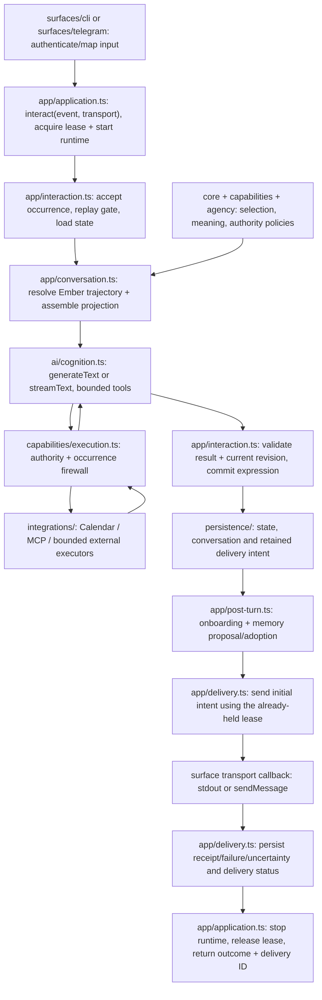

# Canonical Ember Application Flow

Status: accepted migration proposal from [#304](https://github.com/arhor/ember/issues/304),
under [epic #303](https://github.com/arhor/ember/issues/303). Investigated on
2026-09-21 against commit `ea9d1757336162bcc4df4dbb110ad7aebb865964`.
The current-flow sections describe that commit; target paths and contracts are
incremental migration targets. This document owns the cross-module migration proposal,
not the individual semantic contracts linked below. The transport-neutral contract
from #305, production composition root from #306, coordinator facade from #307,
explicit ordinary-flow persistence injection from #308, and application-owned
interaction lease/runtime lifecycle from #309 are implemented; later ownership and
host changes remain proposed until their child issues land. The CLI ordinary-conversation
adapter migration from #310 is also implemented; CLI administrative commands retain their
local command handling.

## Recommendation and governing constraints

Introduce `src/app/application.ts` as the single ordinary interaction coordinator,
with dependencies assembled in `src/composition/ember.ts`. Keep the existing
`core`, `capabilities`, `agency`, `objectives`, and `delegation` semantic namespaces;
renaming all of them to `domain` would add churn. Extract concrete AI SDK execution
into `src/ai/`, file-backed repositories into `src/persistence/`, external capability
clients into `src/integrations/`, and service control into `src/host/`.

Use the already adopted `generateText`/`streamText` tool loop for ordinary cognition.
`ToolLoopAgent` is viable, but currently wraps the same execution functions without
removing any Ember orchestration. Preserve the four-step bound and zero model
retries. Subscription runtimes must enter the same AI execution boundary through
bounded provider adapters; neither their sessions nor SDK agents become Ember.

Three observations constrain the migration:

1. CLI and Telegram already converge at `runSurfaceInteraction`, but each constructs
   stores, providers, memory/onboarding helpers, and runtime episodes before entering
   it. This is the application work to consolidate.
2. `runCognition` commits an expression, persists dialogue, invokes delivery hooks,
   runs onboarding and memory follow-up, sends output, and marks delivery. Splitting
   this function is more consequential than moving directories.
3. Foreground `ember run` already works without systemd. Plain `ember` currently
   fails with “a command is required”; configured run requires prior setup. The
   portability work concerns bootstrap UX and optional service machinery, not removal
   of a daemon that ordinary CLI cognition currently requires.

Preserve the [semantic ADR baseline](decisions/README.md),
[conversation continuity](cross-surface-conversation-continuity.md),
[memory adoption](conversation-memory-proposal-generation.md),
[capability authority](capability-execution-boundary.md),
[delivery reconciliation](delivery-reconciliation-runbook.md),
[objective ownership](durable-objective-lifecycle.md), and
[setup/onboarding semantics](setup-and-onboarding-semantics.md).
Provider state, transcripts, transport IDs, host configuration, and model output
cannot acquire canonical meaning simply by passing through the coordinator.

[ADR 0007](decisions/0007-use-systemd-supervised-episodic-runtime.md) explicitly
allows foreground operation independently of systemd and selects Linux for the
first unattended deployment. [ADR 0008](decisions/0008-add-systemd-supervised-telegram-transport-worker.md)
adds a resident transport, not a resident canonical owner. Keep those guarantees;
#324/#325 must amend their implementation scope when adding replaceable host
adapters. Do not silently mark either accepted ADR superseded here.
[Source layout](source-layout.md) describes today's surface composition permissions;
the proposed import restrictions below take effect incrementally with #319, not
retroactively. The narrower provider placement replaces the implementation direction
in [the provider seam decision](cognition-adapter-contract-decision.md) at #315 while
preserving its Ember-owned request/result semantics.

## 1. Current-flow map

### CLI admission and lifetime

The executable is [bin/ember.ts](../../bin/ember.ts), which imports the CLI public
index and dispatches through [main.ts](../../src/surfaces/cli/main.ts). Explicit
`run` builds `CliSurfaceConfig`. Configured `run` calls `setupRunMain` in
[setup.ts](../../src/surfaces/cli/setup.ts): load machine config, require verified
cognition/available continuity, reject pending onboarding activation, validate the
Calendar binding, and provide a Telegram setup callback. Neither route starts or
contacts systemd.

```mermaid
sequenceDiagram
    participant CLI as cli/main.ts + setup.ts
    participant S as cli/surface.ts
    participant P as persistence stores
    participant R as runtime/runtime.ts
    participant I as runtime/interaction-boundary.ts
    CLI->>S: runCliSurface(config, io)
    S->>P: new StateStore; initial lease; load + validate binding; release
    S->>S: configuredCognitionProvider; readline (no idle writer lease)
    loop Each ordinary nonempty line
        S->>P: withCliLease acquires writer lease; reload state
        S->>R: startRuntime(state, principal, scope)
        S->>P: commit runtime start
        S->>P: new OnboardingWorkStore; load active work
        S->>S: choose provider and optional memory/progress helpers
        S->>I: runSurfaceInteraction(text, runtimeId, provider, deliver=stdout)
        Note over I,R: Shared cognition and delivery sequence below
        I-->>S: outcome + optional follow-up failures
        S->>P: reload; commit stopRuntime; release lease
    end
```

The local surface asserts `explicit_local_argument` provenance and `local_cli`.
Ordinary input supplies no external occurrence ID, so identical lines remain distinct
occurrences. SIGINT aborts the current bounded invocation. `:quit` exits without an
episode. `:new-conversation`, semantic commands, explanation requests, and action
approval commands currently branch inside the surface and access stores directly.
`withCliLease` stops the episode per line, not per readline session; its current
cleanup does not have Telegram's nested `finally` around lease release, so the shared
lifecycle extraction must preserve release even if stop persistence fails.

`configuredCognitionProvider` selects process/Codex/Cursor/Claude adapters. The Claude
closure loads Calendar config and constructs `ActionProposalStore`,
`DurableObjectiveStore`, and `ObjectiveActionCoordinator` when selecting Calendar
bindings. The ordinary path creates default memory and onboarding helpers only while
onboarding is active in the same scope, unless helpers were explicitly injected.
Do not accidentally enable always-on memory generation during extraction.

### Telegram admission, acknowledgement, and lifetime

[bin/ember-telegram.ts](../../bin/ember-telegram.ts) loads config/token, creates the
Bot API client, and installs signal handling. The `serve` command itself can run in
the foreground; a systemd unit is an optional current deployment mechanism.

```mermaid
sequenceDiagram
    participant T as telegram/surface.ts polling
    participant API as Telegram Bot API
    participant P as persistence stores
    participant R as runtime/runtime.ts
    participant I as runtime/interaction-boundary.ts
    T->>API: preflight bot/webhook, then getUpdates
    Note over T,P: Each polling iteration first reconciles ordinary deliveries and proactive contacts
    API-->>T: updates
    T->>T: selectTelegramInbound verifies configured private sender/chat
    T->>P: new StateStore; acquire writer lease; load
    T->>R: startRuntime(principal, scope)
    T->>P: commit runtime start; load OnboardingWorkStore
    T->>T: providerForConfig; optional memory/progress helpers
    T->>I: runSurfaceInteraction(external occurrence + destination + send callback)
    Note over I,R: Same shared cognition and delivery sequence below
    I->>API: delivery callback invokes sendMessage
    API-->>I: confirmed / definite failure / uncertain
    T->>P: reload; commit stopRuntime; finally release lease
    T->>T: advance in-memory offset after handled outcome
    T->>API: next getUpdates(offset) acknowledges older updates
```

`processTelegramUpdate` maps `configured_surface_mapping` provenance to
`telegram_bot`; occurrence, message, thread, and destination identifiers remain
transport evidence. Ignored updates create no cognition. The provider/Calendar and
onboarding construction duplicates CLI wiring. A supplied test/provider override
also suppresses automatically constructed onboarding helpers unless separately
provided. Preserve this deliberate injection behavior in migrated tests.

The polling loop owns an in-memory offset, not an acknowledgement database. A crash
can replay an update; the interaction ledger suppresses another cognition. An admitted
update drains on polling shutdown: `runTelegramPolling` does not forward its polling
abort signal into `processTelegramUpdate`. Moving signal ownership must preserve this
behavior rather than cancelling an admitted send as an incidental refactor.

`reconcileTelegramDeliveries` separately acquires the canonical lease, loads state and
the interaction ledger, checks destinations, and calls `reconcileSurfaceDelivery`.
`reconcileTelegramProactiveContacts` additionally constructs `ProactiveContactStore`,
revalidates attention/currentness, establishes/adopts delivery correlation, maintains
send fences, and records reconciliation outcomes. These latter steps are application
or semantic responsibilities currently embedded in the transport file.

### Shared accepted-input → expression → delivery path

This expansion applies to both diagrams. Source anchors are
[runSurfaceInteraction / reconcileSurfaceDelivery](../../src/runtime/interaction-boundary.ts)
and [runCognition](../../src/runtime/runtime.ts).

| Order | Current owner and concrete operation                                                                                            | Durable/effect boundary                                                                                                                                                        |
| ----- | ------------------------------------------------------------------------------------------------------------------------------- | ------------------------------------------------------------------------------------------------------------------------------------------------------------------------------ |
| 1     | `runSurfaceInteraction` validates principal/runtime, constructs `InteractionLedgerStore(store.path)`, calls `acceptInbound`     | `.interactions.json` records stable occurrence, input digest, provenance, destination and planned cognition ID                                                                 |
| 2     | Same function reloads canonical state and looks for that cognition                                                              | Existing cognition suppresses rerun; completed expression without intent produces a representation-less intent, never an invented reply                                        |
| 3     | `runCognition` constructs `ConversationContextStore(store.path)` and resolves continue/fresh membership                         | `.conversation.json` active Ember trajectory, independent of Telegram chat or provider session                                                                                 |
| 4     | `selectRecentConversationContext`; load `OnboardingWorkStore(store.path)`; `buildProjection`                                    | Scope/currentness/bounds enforced by `core`; onboarding lineage/principal validated; canonical selection remains independent of dialogue                                       |
| 5     | `userEvidence`, cognition `started`, runtime observation, then state commit                                                     | Canonical input evidence exists before `recordAcceptedInput` writes the conversation sidecar                                                                                   |
| 6     | `ProviderInvoker(request, timeout/signal)`                                                                                      | Claude → `createAiSdkProvider` → SDK; Codex/Cursor/process currently bypass SDK. Only selected projection and current input cross the seam                                     |
| 7     | SDK path: select bindings → `tool` schemas → `createCapabilityExecutionFirewall` → integration                                  | SDK loops; Ember authorizes, validates semantic arguments, fences repeated capability attempts, and classifies effects. Calendar action ledger persists consequential attempts |
| 8     | Adapter validates final `ProviderResult`; runtime reloads and requires unchanged revision                                       | Provider failure records failed/timed-out/cancellation evidence; no expression is fabricated                                                                                   |
| 9     | Runtime commits `agent_expression_via_provider` descriptor, completed cognition, `usedMeaningIds`, and delivery `pending`       | Canonical expression evidence is separate from reply text; external thread ID is operational only                                                                              |
| 10    | Conversation store records committed reply text; `afterExpressionCommit` hook creates delivery intent with retained text/digest | Three sequential writes, not one transaction; the retained delivery representation exists before optional follow-up                                                            |
| 11    | Runtime evaluates onboarding progress and saves its sidecar; then calls `generateAndAdoptConversationMemories`                  | Memory helper constructs `.memory-proposals.json`, records generation, assesses/adopts against current canonical revision, and records terminal outcomes                       |
| 12    | `beforeDisplay` transfers follow-up diagnostics to boundary; runtime invokes output callback                                    | Callback records delivery attempt `started` before stdout/sendMessage; finishes `confirmed`, `failed`, or `uncertain`                                                          |
| 13    | Runtime commits cognition delivery `displayed` after successful callback                                                        | Transport acceptance is not human awareness; an output error can leave completed cognition with delivery pending                                                               |
| 14    | Concrete surface reloads/stops runtime and releases writer lease                                                                | Provider/delivery/follow-up waits currently occur within the per-interaction canonical lease                                                                                   |

Default provider-backed memory/progress wrappers make additional provider calls. Memory
uses a synthetic in-memory bootstrap state/projection and JSON in `ProviderResult.reply`;
progress also parses JSON from `reply`. A separate AI SDK structured memory generator
already exists in `memory-proposal-generation.ts`. These are bounded control tasks,
not additional ordinary user interactions or independent agent identities.

Current crash behavior must remain visible: canonical commit may precede its sidecar;
delivery `started` with no terminal record becomes uncertain and is not resent;
confirmed delivery can repair canonical `displayed` without another send; missing
representation blocks recovery. This proposal does not introduce a cross-file
transaction, reconstruct missing replies, or claim exactly-once network effects.

### Adjacent entry paths at the application boundary

- `scheduleWake` in `runtime/episodic-runtime.ts` persists a wake intent through
  `EpisodicRecordStore` and directly constructs `SystemdUserSupervisor` to activate
  it now or later. `runWakeWorker` checks dispatch observations, constructs StateStore,
  acquires its lease, starts a runtime, records dispatch, and calls
  `agency/cognition-opportunity.ts::runCognitionOpportunity` with a configured Codex
  evaluator. That function builds a topic-free projection, applies repeated-attention
  policy, and persists decision/failure evidence. The worker stops the runtime and
  records completion. It does not call ordinary `runCognition` or turn a `cognition`
  decision into a fabricated user message or automatically sent reply.
- `startSpecialistEpisode` persists a specialist specification before launching a
  supervised worker. `runSpecialistWorker` records `worker_started`, rejects duplicate
  execution, and calls `runCodexSpecialist` with a separate record path. Specialist
  completion is not canonical reintegration: `specialist-reintegration.ts` separately
  checks current revision, authority and report evidence before canonical reliance.
  Keep that distinction when app services replace supervisor-coupled orchestration.
- `ObjectiveActionCoordinator` already receives objective/action stores explicitly.
  Its `createProposal` checks a current objective step, `revalidate` gates later
  execution, and `reintegrate` checkpoints attributed action effects. Both surface
  Claude factories reconstruct this coordinator only to supply Calendar revalidation.
  Ordinary messages do not automatically become objectives, and model/tool completion
  does not complete one. Move the wiring, preserving this existing narrower behavior.
- Telegram's proactive reconciliation consumes previously durable contact intents;
  it is not their semantic origin. `configured-proactive-contact-policy.ts` loads
  authority/quiet-hour/surface configuration and independently reopens the contact
  sidecar to detect shared-source duplicates. Application contact orchestration should
  supply that snapshot, invoke the existing attention policy, persist an admitted
  assessment and handoff, and use the same delivery executor. A wake, pending contact,
  policy admission, delivery attempt, and confirmed delivery remain distinct records.

## 2. Target-flow map and lifetime

`composition/ember.ts` constructs the application once per process from validated host
configuration. It opens repositories and configures inference, capabilities, optional
memory/progress evaluators, and diagnostics. It passes a small application API into each
surface. A resident worker and a foreground process use this same function and code.

As implemented by #306, `composeEmberApplication` is the production construction
boundary for ordinary CLI and Telegram instances. It derives all current sidecar
repositories from the configured canonical state path, selects the cognition provider,
wires Calendar capability/objective collaborators, and constructs post-turn memory and
onboarding helpers. Its explicit overrides let tests supply deterministic providers,
helpers, clocks, IDs, and store mechanics without reading process or global configuration.
As implemented by #308, the resulting state, conversation, interaction/delivery,
onboarding, and memory-generation repositories are passed explicitly through the
application, interaction, cognition, and post-turn calls; those deeper modules no longer
reconstruct sibling stores from `StateStore.path`. As hardened by #309,
`EmberApplication.interact()` owns its writer lease and ordinary runtime episode through
provider execution and initial delivery, persists the existing success/failure stop
reasons, records an in-flight cognition as outcome-unknown when application work throws,
and releases the lease even when runtime-stop persistence fails. The CLI ordinary-message
path now enters through this application-owned coordinator; Telegram retains its legacy
orchestration until #311 migrates it. CLI administrative commands remain local and do not
form an alternative ordinary-interaction path.



The arrows are execution/data flow, not unrestricted imports. `app/interaction.ts`
is the ordinary use case; `application.ts` exposes it and handles lifetime. Other
named app modules are focused helpers, not alternative coordinators. No event bus,
surface registry, framework session, or DI container is needed.

1. The adapter supplies validated principal provenance and opaque transport metadata.
   Application admission independently checks configured principal, scope, and continuity
   binding. A surface string or SDK tool availability never grants authority.
2. Application acquires the injected writer lease, loads current state, and records an
   Ember runtime episode. Keep the current interaction-length lease initially, including
   inference, post-turn work, initial delivery and runtime stop. Never hold it while
   waiting for the next CLI line or poll.
3. The replay gate and conversation preparation run once. `core` selects bounded memory,
   dialogue, onboarding guidance, and authority-relevant context; application selects
   capability bindings through injected policies. Adapters do not open stores to select them.
4. AI execution receives a bounded `ProviderRequest` and returns a validated Ember result.
   Application checks the result at its trust boundary too, then revalidates the state
   revision. SDK output success alone cannot commit meaning or declare an effect.
5. Commit expression evidence, conversation representation, and retained delivery intent
   in the existing order. Only then run optional onboarding and memory work. Keep their
   current order and diagnostic behavior; moving delivery earlier is a separate behavior
   change. Control calls receive no action tools by default.
6. Without stopping the runtime or releasing the lease, `app/application.ts` passes the
   committed intent to `app/delivery.ts`. The delivery helper validates its binding,
   persists `started`, invokes the transport callback supplied to `interact`, records
   the observed outcome, and updates canonical delivery status on confirmation. It uses
   the already-held lease; it must not call the public recovery method and acquire it again.
   Cognition has finished before this call and knows nothing about transport callbacks.
7. Only after initial delivery handling finishes does the application reload and stop the
   runtime, release the lease in nested `finally` cleanup, and return references, delivery
   outcome and diagnostics. Provider failure, send failure and persistence exceptions
   also pass through this cleanup. The lease is continuous from admission through stop,
   preserving today's serialization across CLI, Telegram and cooperating processes.
8. Public `app.deliver` is a later recovery operation, not the second half of ordinary
   admission. It acquires its own lease, reloads/reconciles the stored intent, and calls
   the same delivery helper under that lease. It does not rerun cognition or post-turn
   work. Recovery updates delivery evidence without reopening a stopped runtime or
   extending its clean-stop timestamp. Telegram retains its handled-outcome and polling
   acknowledgement policy, including drain of an admitted interaction.

Continuous lease ownership prevents a later cooperating interaction from committing
between an earlier expression and its initial send, and prevents a recovery worker
from classifying that live send as abandoned. Eligibility/replay/attempt checks provide
the separate protection against duplicate or ineligible sends; those checks alone do
not serialize two distinct turns. This preserves live-path ordering, not a new global
FIFO guarantee after crashes or failed/uncertain sends. Shortening the lease would
require a separately reviewed durable ordering and attempt-ownership design.

#312 must add a cross-surface/process interleaving regression: pause CLI turn A after
expression/intent commit but before attempt start, try Telegram turn B and recovery of
A from independently constructed applications, and assert neither can mutate or send
under A's lease. Repeat while A's transport is in flight. After A records its outcome
and stops/releases, B can proceed and its projection sees A's truthful delivery status.
Also cover A's definite failure, uncertainty, abrupt process loss and stop-write failure:
recovery must preserve existing no-resend rules and orderly cleanup must release the
lease even when stop persistence throws. Lock contention may reject rather than queue;
the fixture should retry only after release, not invent a new scheduler.

## 3. Ownership matrix

“Persistence” below implements writes/locks; it does not decide what is true.

| Responsibility                                                                                  | Accountable owner                                            | Collaborators / excluded ownership                                               |
| ----------------------------------------------------------------------------------------------- | ------------------------------------------------------------ | -------------------------------------------------------------------------------- |
| Readline, Telegram polling, mapping authenticated sender, opaque occurrence IDs, concrete sends | Surface                                                      | Application validates assertions; transport IDs do not identify Ember            |
| Dependency construction, configuration loading, provider choice                                 | Application composition (`composition/ember.ts`)             | Host resolves paths/auth; surfaces receive configured application                |
| Writer lease lifetime and orderly interaction cleanup                                           | Application (`app/application.ts`)                           | Persistence implements lease; host signals cancellation/drain                    |
| Runtime start/stop and recovery meaning                                                         | Ember semantics (`core/runtime-episode.ts`)                  | Application commits transitions; service manager observes processes only         |
| Inbound acceptance/replay and application sequencing                                            | Application (`app/interaction.ts`)                           | Semantic occurrence checks; injected interaction repository                      |
| Conversation membership decision                                                                | Ember semantics (`core/conversation-context.ts`)             | Application resolves intent/cursor and calls repository                          |
| Projection construction/disclosure/currentness                                                  | Ember semantics (`core/projection.ts`)                       | `app/conversation.ts` supplies explicit snapshots                                |
| Memory candidate generation                                                                     | AI SDK mechanics (`ai/memory-proposals.ts`)                  | Ember supplies bounded generation contract/projection                            |
| Memory assessment/adoption and supersession                                                     | Ember semantics (`core/memory-proposal.ts`)                  | `app/post-turn.ts` coordinates ledger and canonical commits                      |
| Onboarding progress interpretation/validation                                                   | Ember semantics (`core/onboarding-work.ts`)                  | AI control adapter proposes; application schedules and persists                  |
| Capability selection and current authority                                                      | Ember semantics (`capabilities/`)                            | Composition supplies bindings; no model-selected expansion of authority          |
| Tool schemas, model steps, structured output, provisional streaming                             | AI SDK mechanics (`ai/`)                                     | `tool`, `jsonSchema`, `Output`, bounded SDK loop                                 |
| Approval, effect occurrence, uncertainty, safe retry                                            | Ember semantics (`capabilities/`)                            | Action repository persists pre-effect attempt and outcomes                       |
| Calendar HTTP/OAuth, MCP transport, runtime-specific authentication                             | External integration (`integrations/`, AI provider adapters) | No authority inference from credentials or connectivity                          |
| Final expression validation and commit sequencing                                               | Application                                                  | Core evidence rules and provider contract validator; persistence revision checks |
| Delivery intent, reconciliation and send-attempt lifetime                                       | Application (`app/delivery.ts`)                              | Core delivery rules, persistence ledger, surface transport callback              |
| Actual transport acceptance/error evidence                                                      | Surface                                                      | Application records it; acceptance does not mean read/understood                 |
| Durable objective purpose, currentness, next-step ownership                                     | Ember semantics (`objectives/`)                              | Application coordinates; SDK step completion cannot complete an objective        |
| Proactive-contact admission, silence, quiet hours, duplicate suppression                        | Ember semantics (`agency/`)                                  | Application reconciles intents/delivery; host wake carries no motive             |
| Specialist purpose, disclosure, authority and reintegration                                     | Ember semantics (`delegation/`)                              | Application starts/reconciles bounded work; external runtime owns execution      |
| JSON encodings, migrations, atomic replacement, lease mechanics                                 | Persistence                                                  | No sibling path discovery by callers; no new storage engine                      |
| Process spawn, bounded kill/drain, service installation/status                                  | External integration / host infrastructure                   | Neither PID nor service status determines semantic success                       |
| Explicit create/restore, provider verification, secret entry                                    | Application bootstrap + host/integration                     | Learned relationship meaning follows ordinary conversation/adoption              |

## 4. Current-file migration matrix

Paths are relative to `src/` unless prefixed with `bin/`. Rows grouping files name
each file and give the same disposition to each. `—` means no SDK substitution.
Tasks reference the child numbers in #303. A split removes the superseded orchestration
or implementation after callers migrate; it does not retain a permanent facade.

| Current file                                                                                                                | Current responsibility                                                     | Target owner/module                                                                                                           | Disposition | AI SDK primitive                                      | Migration task                                                                        |
| --------------------------------------------------------------------------------------------------------------------------- | -------------------------------------------------------------------------- | ----------------------------------------------------------------------------------------------------------------------------- | ----------- | ----------------------------------------------------- | ------------------------------------------------------------------------------------- |
| `surfaces/cli/surface.ts`                                                                                                   | Readline, stores, leases, providers, commands, follow-up, stdout           | Surface IO; `app/application.ts`, `composition/ember.ts`, narrow app command handlers                                         | SPLIT       | —                                                     | #306, #309, #310; remove `configuredCognitionProvider` and `withCliLease`             |
| `surfaces/telegram/surface.ts`                                                                                              | Bot API, admission, providers, leases, recovery, unit rendering            | Surface transport; app interaction/delivery/contact; host systemd renderer                                                    | SPLIT       | —                                                     | #311, #312, #322; delete `providerForConfig`                                          |
| `surfaces/cli/main.ts`                                                                                                      | Typed dispatch, explicit run composition, operator commands                | CLI dispatch; composition/bootstrap entry                                                                                     | SPLIT       | —                                                     | #310, #323, #326; keep one parser                                                     |
| `surfaces/cli/model.ts`                                                                                                     | Typed CLI grammar/configured versus explicit run                           | CLI grammar plus default invocation                                                                                           | KEEP        | —                                                     | #323, #326                                                                            |
| `surfaces/cli/index.ts`, `surfaces/telegram/index.ts`                                                                       | Public surface APIs exporting mixed responsibilities                       | Transport public entry points; export application/host APIs from their owners                                                 | SPLIT       | —                                                     | #310, #311, #319                                                                      |
| `surfaces/cli/setup.ts`                                                                                                     | Config, provider probe, restore/create, onboarding activation, run handoff | `app/bootstrap.ts`, `composition/ember.ts`, `host/setup.ts`; CLI prompts remain                                               | SPLIT       | Shared AI execution for probe                         | #306, #322, #326                                                                      |
| `surfaces/cli/google-calendar-setup.ts`                                                                                     | Trusted OAuth/configuration CLI flow                                       | CLI prompts + `integrations/google-calendar/setup.ts`                                                                         | SPLIT       | —                                                     | #322, #327; preserve explicit mutations and secret isolation                          |
| `surfaces/telegram/setup.ts`                                                                                                | Token/mapping/config/service installation/round-trip verification          | Telegram setup prompts + `host/setup.ts` + host service adapter                                                               | SPLIT       | —                                                     | #322, #324, #325, #327                                                                |
| `runtime/interaction-boundary.ts`                                                                                           | Ledger schemas/storage, ordinary wrapper, output bridge, recovery          | `core/interaction.ts`, `persistence/interaction-ledger-store.ts`, `app/interaction.ts`, `app/delivery.ts`                     | SPLIT       | —                                                     | #307, #308, #312; DELETE old `runSurfaceInteraction`/Writable bridge at #318          |
| `runtime/runtime.ts`                                                                                                        | Runtime semantics plus all cognition orchestration/output                  | `core/runtime-episode.ts`; app interaction/conversation/post-turn/delivery                                                    | SPLIT       | —                                                     | #309, #312–#314, #317; DELETE `runCognition`/hook protocol at #318                    |
| `runtime/episodic-runtime.ts`                                                                                               | Wake/specialist records, workers, supervisor, unit/config helpers          | App opportunity/work orchestration; persistence episode records; `host/systemd.ts`                                            | SPLIT       | —                                                     | #317, #322, #324                                                                      |
| `runtime/process-lifecycle.ts`                                                                                              | Bounded subprocess IO, cancellation/termination observations               | `host/process-lifecycle.ts`                                                                                                   | MOVE        | —                                                     | #315, #322; shared by inference and specialist execution                              |
| `providers/contract.ts`                                                                                                     | Ember request/result/observer and validation plus process limits           | `core/cognition.ts`; process limits to host/provider adapters                                                                 | SPLIT       | —                                                     | #305, #315                                                                            |
| `providers/ai-sdk.ts`                                                                                                       | SDK invocation, tools, output, streaming, failure/evidence translation     | `ai/cognition.ts` and small internal `ai/tools.ts`, `ai/evidence.ts`                                                          | MOVE        | `generateText`, `streamText`, `tool`, `Output.object` | #315, #316                                                                            |
| `providers/claude-code.ts`                                                                                                  | Subscription-backed model, isolated settings/workspace/auth                | `ai/providers/claude-code.ts` model factory; shared cognition executor                                                        | SPLIT       | Existing `LanguageModel` provider                     | #315; remove nested ordinary-provider construction                                    |
| `providers/codex.ts`                                                                                                        | Prompt/result protocol, CLI flags, JSONL, thread/exit evidence             | `ai/providers/codex.ts` bounded model bridge + host process helper                                                            | SPLIT       | `LanguageModelV4` bridge                              | #315b; delete direct ordinary invocation after parity                                 |
| `providers/cursor.ts`                                                                                                       | Prompt/JSON result, isolated CLI/session, exit evidence                    | `ai/providers/cursor.ts` bounded model bridge + host process helper                                                           | SPLIT       | `LanguageModelV4` bridge                              | #315c; preserve unsupported-tool behavior                                             |
| `providers/process.ts`                                                                                                      | Generic process protocol and provider label                                | `ai/providers/process.ts` explicit compatibility/fixture model bridge; `composition/provider-label.ts`                        | SPLIT       | SDK model bridge; SDK test models for new fixtures    | #315, #318; preserve explicit process configuration, no automatic production fallback |
| `providers/evidence.ts`                                                                                                     | Evaluation-only sanitized Codex argument/model-selection evidence          | `eval/longitudinal/codex-argument-evidence.ts`; test at `tests/codex-argument-evidence.test.ts`                               | MOVE        | —                                                     | #319; keep outside production; move colocated test to that flat `tests/` path         |
| `memory/memory-proposal-generation.ts`                                                                                      | Projection, contracts, generation/adoption orchestration, SDK adapter      | `memory/` semantics; `app/post-turn.ts`; `ai/memory-proposals.ts`                                                             | SPLIT       | `generateText` + `Output.object` already present      | #308, #314, #315d                                                                     |
| `memory/provider-memory-proposal-generator.ts`                                                                              | Synthetic state and JSON-in-reply control adapter                          | Shared typed `ai/memory-proposals.ts`                                                                                         | COLLAPSE    | `Output.object`                                       | #315d; DELETE wrapper after all production backends support typed calls               |
| `onboarding/progress-evaluator.ts`                                                                                          | Control contract, prompt, JSON-in-reply parsing                            | `core/onboarding-work.ts` contract + `ai/onboarding-progress.ts`                                                              | SPLIT       | `Output.object`                                       | #314, #315d; delete reply parsing                                                     |
| `core/model.ts`, `core/errors.ts`, `core/semantics.ts`                                                                      | Canonical types, errors, evidence/meaning transitions                      | Existing core                                                                                                                 | KEEP        | —                                                     | #305, #313; no framework types                                                        |
| `core/projection.ts`, `core/conversation-context.ts`                                                                        | Selection, bounds, membership/context semantics                            | Existing core; application supplies loaded snapshots                                                                          | KEEP        | —                                                     | #313                                                                                  |
| `core/memory-proposal.ts`, `core/onboarding-work.ts`                                                                        | Proposal adoption and onboarding transitions                               | Existing core                                                                                                                 | KEEP        | —                                                     | #314                                                                                  |
| `core/state-materialization.ts`, `persistence/markdown-state-materializer.ts`                                               | Derived human-readable state views/edit proposals                          | Existing core/persistence; outside ordinary flow                                                                              | KEEP        | —                                                     | #319; never replace canonical state with views                                        |
| `persistence/state-store.ts`, `persistence/file-replacement.ts`                                                             | Canonical revision/lease and durable file IO                               | Injected persistence implementation                                                                                           | KEEP        | —                                                     | #306, #308                                                                            |
| `persistence/conversation-context-store.ts`                                                                                 | Versioned trajectory and exchange persistence                              | Injected conversation repository                                                                                              | KEEP        | —                                                     | #308, #313                                                                            |
| `persistence/onboarding-work-store.ts`                                                                                      | Temporary onboarding persistence                                           | Injected onboarding repository                                                                                                | KEEP        | —                                                     | #308, #314                                                                            |
| `persistence/memory-proposal-generation-store.ts`                                                                           | Durable generation outcomes                                                | Injected generation repository                                                                                                | KEEP        | —                                                     | #308, #314                                                                            |
| `capabilities/execution.ts`                                                                                                 | Authority, argument, occurrence, bounded evidence firewall                 | Existing semantic capability boundary                                                                                         | KEEP        | `tool.execute` calls it                               | #316; remove no semantic guard                                                        |
| `capabilities/action-proposal.ts`                                                                                           | Approval/effect semantics plus file-backed action ledger                   | `capabilities/action-proposal.ts` + `persistence/action-proposal-store.ts`                                                    | SPLIT       | —                                                     | #308, #319                                                                            |
| `capabilities/google-calendar.ts`, `capabilities/google-calendar-create.ts`                                                 | Integration config/HTTP plus selected read/create bindings                 | `integrations/google-calendar/`; bindings retain Ember capability contract                                                    | MOVE        | `tool` mapping only in AI                             | #306, #316, #319                                                                      |
| `capabilities/mcp-ai-sdk.ts`                                                                                                | MCP transport/discovery and explicit capability binding                    | `integrations/mcp/ai-sdk.ts`                                                                                                  | MOVE        | `createMCPClient`, stdio transport                    | #316, #319                                                                            |
| `capabilities/local-lookup.ts`                                                                                              | Deterministic bounded local capability                                     | Existing capability                                                                                                           | KEEP        | `tool` mapping only in AI                             | #316                                                                                  |
| `objectives/durable-objective.ts`                                                                                           | Objective lifecycle and self-locking persistence                           | `objectives/` semantics + `persistence/durable-objective-store.ts`                                                            | SPLIT       | —                                                     | #308, #319                                                                            |
| `objectives/objective-action.ts`                                                                                            | Objective/action revalidation and checkpoint orchestration                 | `app/objective-action.ts`, retaining objective policies                                                                       | MOVE        | —                                                     | #306, #308, #319                                                                      |
| `agency/cognition-opportunity.ts`                                                                                           | Opportunity projection/evaluation and state commits                        | `agency/` semantics + `app/opportunity.ts`                                                                                    | SPLIT       | Typed AI evaluator                                    | #317                                                                                  |
| `agency/ai-sdk-opportunity-evaluator.ts`                                                                                    | Structured opportunity decision                                            | `ai/opportunity.ts`                                                                                                           | MOVE        | `generateText` + `Output.object`                      | #315d                                                                                 |
| `agency/codex-opportunity-evaluator.ts`                                                                                     | Legacy exact-token provider control protocol                               | Shared typed opportunity executor                                                                                             | COLLAPSE    | `Output.object` through Codex bridge                  | #315d; DELETE after silence/failure parity                                            |
| `agency/endogenous-attention-control.ts`, `agency/interruption-decision.ts`, `agency/proactive-contact-attention-policy.ts` | Attention, interruptibility and admission meaning                          | Existing agency semantics                                                                                                     | KEEP        | —                                                     | #317, #319                                                                            |
| `agency/proactive-contact-store.ts`                                                                                         | Contact identity/lifecycle, fences, persistence                            | Agency transitions + `persistence/proactive-contact-store.ts`                                                                 | SPLIT       | —                                                     | #308, #311, #319                                                                      |
| `agency/configured-proactive-contact-policy.ts`                                                                             | Config loading, attention/authority snapshots, sibling-store lookup        | Composition policy loader + `app/proactive-contact.ts` using injected contacts                                                | SPLIT       | —                                                     | #308, #311                                                                            |
| `agency/endogenous-selectivity-evaluation.ts`                                                                               | Behavioral evaluation support                                              | Existing evaluation support, outside production interaction                                                                   | KEEP        | —                                                     | #319; no new coordinator                                                              |
| `delegation/codex.ts`                                                                                                       | One-line re-export of Codex environment filtering                          | `integrations/codex/environment.ts`, shared by AI provider and specialist integration                                         | COLLAPSE    | —                                                     | #315, #317; DELETE re-export and move imports to shared integration helper            |
| `delegation/codex-specialist.ts`                                                                                            | Envelope, child execution, records, reconciliation                         | `delegation/specialist.ts`, `app/specialist.ts`, `integrations/codex/specialist.ts`, `persistence/specialist-record-store.ts` | SPLIT       | No ordinary tool-loop substitution                    | #317, #319; keep change limited to shared boundary dependencies                       |
| `delegation/specialist-reintegration.ts`                                                                                    | Currentness/authority decisions and crash-consistent file evidence         | `delegation/specialist-reintegration.ts` policy; `app/specialist-reintegration.ts`; `persistence/specialist-record-store.ts`  | SPLIT       | —                                                     | #317, #319; retain record correlation                                                 |
| `util.ts`                                                                                                                   | Plain validation, clone, digest helpers                                    | Shared pure utilities                                                                                                         | KEEP        | —                                                     | #319; no service locator                                                              |
| `bin/ember.ts`, `bin/ember-telegram.ts`, `bin/ember-runtime.ts`                                                             | Process entry, args/signals and mixed composition                          | Thin executable roots using composition and host/surface adapters                                                             | SPLIT       | —                                                     | #306, #322–#326                                                                       |

## 5. Public application contract

Proposed types below are design notation. Reuse/move existing Ember types for
`PrincipalAssertionProvenance`, `ExternalOccurrenceMetadata`, `CognitionStatus`,
`ConversationMembershipIntent`, and `DeliveryReconciliationResult`; do not import
their definitions from runtime implementations or from the SDK. #305 found that
`DeliveryObservation`'s `failed` variant needs `externalMessageId` too, to keep
representing the evidence a definite rejected-message failure already carries
today; the snippet below reflects that correction rather than the original notation.

```ts
interface InteractionEvent {
  kind: "message";
  principal: string;
  principalProvenance: PrincipalAssertionProvenance;
  scope: string;
  surfaceId: string;
  text: string;
  externalOccurrence?: ExternalOccurrenceMetadata;
  deliveryDestinationId?: string;
  conversationMembership?: ConversationMembershipIntent;
}

interface InteractionResult {
  occurrenceId: string;
  cognitionId: CognitionId;
  cognitionStatus: CognitionStatus;
  replayed: boolean;
  deliveryId: string | null;
  delivery: DeliveryReconciliationResult | null;
  diagnostics: {
    providerFailure: string | null;
    memoryProposalFailure: string | null;
    onboardingProgressFailure: string | null;
  };
}

interface DeliveryAddress {
  principal: string;
  scope: string;
  surfaceId: string;
  destinationId: string | null;
}

type DeliveryObservation =
  | { outcome: "confirmed"; externalMessageId: string | null }
  | { outcome: "failed"; retryable: boolean; retryAfterSeconds: number | null; externalMessageId: string | null }
  | { outcome: "uncertain"; externalMessageId: string | null };

type TransportSend = (
  intent: { deliveryId: string; address: DeliveryAddress; text: string },
  options: { signal?: AbortSignal },
) => Promise<DeliveryObservation>;

interface EmberApplication {
  interact(
    event: InteractionEvent,
    transport: TransportSend,
    options?: { signal?: AbortSignal },
  ): Promise<InteractionResult>;
  pendingDeliveries(address: DeliveryAddress): Promise<readonly string[]>;
  deliver(
    request: { deliveryId: string; address: DeliveryAddress },
    transport: TransportSend,
    options?: { signal?: AbortSignal },
  ): Promise<DeliveryReconciliationResult>;
}
```

No event contains a store/path, provider instance, runtime ID, `Writable`, SDK message,
or credentials. The application receives a transport callback as a separate collaborator,
not as cognition input. `interact` returns only after initial delivery handling and
runtime cleanup; `delivery` records that handling or is null when it did not run
(for example provider failure or a suppressed replay). Its ID can still identify a
previously committed pending intent. An existing cognition replay does not rerun cognition,
post-turn work or initial send; the normal recovery path handles any pending intent.

`pendingDeliveries` returns references scoped to the authenticated binding. Public
`deliver` is for recovery; it acquires a lease and revalidates the stored binding and
current eligibility regardless of what the caller supplies. The initial-send helper
uses the same validations within `interact`'s existing lease. These checks prevent
duplicate/ineligible sends; uninterrupted lease ownership provides live-turn ordering.
Only an eligible durable attempt exposes retained text to the transport callback.
Unexpected callback throws are recorded as uncertain, as today, with existing
surface-specific error/acknowledgement behavior retained by the adapter.
Storage/admission errors still reject the operation; they must not be encoded as
model failure or a successful handled interaction. A failure after expression commit
can be recovered by occurrence/delivery correlation rather than a second cognition.

CLI writes the payload and maps its write callback to acceptance. Telegram maps the
payload destination to its verified chat/thread and normalizes Bot API evidence.
Both invoke `interact(event, transport)` once per ordinary input; the application
sequences cognition and initial delivery internally under one lease. Surfaces call
public `deliver` only from their explicit recovery paths, which perform no-send checks
inside the application. No surface inspects ledger records to decide retry policy.
An abandoned foreground process leaves
pending work durable, but does not promise to print old replies into a different terminal
automatically; explicit CLI recovery must preserve destination/session safety.

Keep administrative commands as narrow application operations when moving their
existing direct store accesses: fresh-conversation, meaning correction, proposal
presentation/decision, and inspection do not need a universal event union. Opportunity,
objective, specialist, and contact helpers share the same composed dependencies and
lease policy, but must not pretend a wake or specialist result is a user message.

## 6. AI SDK extraction audit

### Version and evidence

`package.json` pins `ai@7.0.93`, `@ai-sdk/mcp@2.0.45`, and
`ai-sdk-provider-claude-code@4.3.1`. On 2026-09-21 `npm view ai version` returned
`7.0.107`; this is a patch difference, not a reason to upgrade dependencies in a
documentation spike. Decisions below use installed source and bundled version-matched
documentation, rechecked against current upstream pages:

- [Agents overview](https://ai-sdk.dev/docs/agents/overview) and
  [ToolLoopAgent reference](https://ai-sdk.dev/docs/reference/ai-sdk-core/tool-loop-agent)
  recommend reusable agent configuration and document output, step controls and callbacks.
- Installed `node_modules/ai/src/agent/tool-loop-agent.ts` implements `generate` and
  `stream` by calling `generateText` and `streamText`. Its default is `isStepCount(20)`.
  Installed `src/generate-text/generate-text.ts` defaults to `isStepCount(1)` but accepts
  the multi-step stop condition already used by Ember. The reference page's introductory
  “single-step” shorthand does not mean `generateText` cannot run tools repeatedly.
- Installed `docs/03-agents/04-loop-control.mdx`, `src/agent/tool-loop-agent-settings.ts`,
  and `src/generate-text/generate-text.ts` provide the version-specific loop, timeout,
  retry and callback contract. Current names include `isStepCount`, `instructions`,
  `onStepEnd`, and `onEnd`; do not copy older `stepCountIs`/callback names from #178.
- `package-lock.json` resolves `@ai-sdk/provider@4.0.10`. Installed
  `@ai-sdk/provider/src/language-model/v4/` defines the native model bridge used below:
  `LanguageModelV4`, `LanguageModelV4CallOptions`, `LanguageModelV4GenerateResult`, and
  `LanguageModelV4StreamResult`. The discriminator is lowercase
  `specificationVersion: 'v4'`. Standardized prompt, `responseFormat`, tools and abort
  signal are adapter-local inputs; SDK types never become Ember contracts.
- Installed `ai/src/model/resolve-model.ts` resolves models to V4;
  `ai/src/model/as-language-model-v4.ts` also accepts V3 through a compatibility proxy.
  That explains why V3 sources and existing V3 mocks remain present, but supplies no
  reason to target V3 for new bridges. The current
  [custom-provider documentation](https://ai-sdk.dev/providers/community-providers/custom-providers)
  and [Ember's SDK evaluation](vercel-ai-sdk-modular-cognition-evaluation.md) identify
  V4. Use installed declarations for exact shapes/casing; the upstream illustrative
  snippet currently capitalizes `'V4'`, unlike the installed discriminator.
- Current [HarnessAgent documentation](https://ai-sdk.dev/docs/ai-sdk-harnesses/harness-agent),
  also bundled with `ai`, was checked separately. It introduces additional harness and
  sandbox packages and native session ownership; it is not the existing `LanguageModel`
  provider seam.

### ToolLoopAgent decision

Continue with `generateText`/`streamText` inside one `ai/cognition.ts` executor. This
uses the SDK's built-in loop, not an Ember-authored tool loop. The current adapter
already builds one invocation configuration shared by streaming and non-streaming
execution. Adding `ToolLoopAgent` would still require the same per-cognition firewall,
bounded projection, output validation, diagnostics translation, and application commits.
Moving those responsibilities into `prepareCall`, `prepareStep`, or agent state would
hide the intended application sequence again.

`ToolLoopAgent` is technically suitable if reusable agent configuration later deletes
material duplication. It is not unsuitable because of persistence or provider limits;
it simply supplies no demonstrated simplification here. If adopted later, instantiate
per bounded execution or supply fully isolated call options; explicitly set
`stopWhen: isStepCount(4)` and `maxRetries: 0`, retain final validation, and keep agent
objects/results/messages out of persistence. Neither its default twenty steps nor an
SDK approval response is an Ember policy decision.

| Existing mechanic / file                                              | Disposition                                                | Primitive or retained reason                                                                                                         |
| --------------------------------------------------------------------- | ---------------------------------------------------------- | ------------------------------------------------------------------------------------------------------------------------------------ |
| Model call in `providers/ai-sdk.ts`                                   | Keep SDK implementation, move                              | `generateText`; delete surface-level provider factories after composition moves                                                      |
| Manual ordinary invocation in Codex/Cursor adapters                   | Replace outer execution; keep runtime protocol translation | SDK model bridge below, then shared `generateText`; do not wrap `runCognition` in another loop                                       |
| Four-step tool sequencing and schemas                                 | Keep SDK mechanics                                         | `tool`, `jsonSchema`, `isStepCount(4)` already implement them; #316 is consolidation, not new loop implementation                    |
| Capability selection/authority/input currentness/occurrence fence     | Keep custom                                                | Ember firewall remains `tool.execute` delegate; SDK approval/tool availability cannot replace it                                     |
| Final result schema                                                   | Keep SDK structural validation                             | `Output.object`; `validateProviderResult` remains independent semantic validation                                                    |
| Provisional structured streaming                                      | Keep SDK parsing, keep small observation translator        | `streamText`, `partialOutputStream`, final `result.output`; snapshots never become expression or delivery truth                      |
| Memory structured generation in `memory-proposal-generation.ts`       | Move existing SDK code                                     | `generateText` + `Output.object`; retain proposal assessment and durable generation outcomes                                         |
| Memory/progress JSON embedded in ordinary `reply`                     | Replace after backend bridges                              | Typed `Output.object` control calls; remove synthetic continuity and nested JSON parsing                                             |
| Codex opportunity exact-token protocol                                | Replace after bridge                                       | Existing AI SDK opportunity schema/validator; retain deliberate silence versus failure                                               |
| SDK error/lifecycle translation                                       | Keep narrow shared helpers                                 | `onStart`, `onStepEnd`, tool-execution callbacks, `onEnd`, supported SDK error guards; no raw prompts or metadata in canonical state |
| Model/network retries                                                 | Keep explicit zero policy                                  | `maxRetries: 0` overrides SDK default two; tool continuation is not an effect retry                                                  |
| Capability/delivery retries and Calendar effect recovery              | Keep custom                                                | Durable occurrence, authority, uncertainty, retry delay and provider recovery evidence are application/domain decisions              |
| MCP framing/tool conversion                                           | Keep existing SDK infrastructure                           | `createMCPClient`, `Experimental_StdioMCPTransport`, discovery/call APIs; explicit allowlisted binding stays Ember-owned             |
| MCP bounded discovery/observed close/uncertain call result            | Defer replacement                                          | Existing adapter earns truthful shutdown and failure distinctions; `client.tools()` alone does not establish them                    |
| CLI subprocess buffers, kill grace, direct-child exit                 | Keep custom host mechanics                                 | SDK abort does not prove child exit or absence of remote effects                                                                     |
| Conversation history, objective checkpoints, memory, approval records | Keep Ember persistence                                     | No SDK session/memory/workflow adoption                                                                                              |
| Specialist delegation loop                                            | Keep external specialist boundary                          | It is a delegated work episode, not ordinary cognition or a second Ember architecture                                                |

### Subscription runtimes in one stack

Claude already enters the SDK through `ai-sdk-provider-claude-code`: isolated temporary
workspace, `maxTurns: 1`, empty native tools/MCP/skills/plugins/agents, no persisted
session, no permission prompts, and subscription-only credential environment. Keep this
policy, with model creation below the common AI executor. SDK-dispatched Ember tools
remain outside the native runtime and pass the firewall.

For Codex and Cursor, split process mechanics from Ember prompt/result encoding and
implement thin `LanguageModelV4` bridges in #315b/#315c:

1. Accept only the supported text/instruction prompt and JSON response format emitted
   by Ember's executor. Convert SDK `responseFormat.schema` to Codex's output-schema
   file; instruct Cursor with that schema and let SDK parsing plus Ember validation
   reject malformed output. Do not report Cursor schema enforcement as provider-native.
2. Reuse current environment allowlists, clean workspace/config, no ambient rule/tool
   authority, bounded output, fresh ordinary invocation, timeout and exit observations.
   Preserve provider continuation handles only through a narrow operational translator.
   Keep structured child termination evidence in an adapter-owned error translated at
   the AI boundary; never let SDK timeout alone claim confirmed child termination.
3. Implement `doGenerate(LanguageModelV4CallOptions)` with a
   `LanguageModelV4GenerateResult`: ordered `content` (JSON as a text part),
   `finishReason: { unified, raw }`, nested `usage.inputTokens`/`usage.outputTokens`,
   and `warnings`. The two usage objects are required even when Codex/Cursor report no
   usage; represent that case without invented zeroes:
   ```ts
   usage: {
       inputTokens: {
           total: undefined,
           noCache: undefined,
           cacheRead: undefined,
           cacheWrite: undefined,
       },
       outputTokens: {
           total: undefined,
           text: undefined,
           reasoning: undefined,
       },
   }
   ```
   Required `doStream` returns `LanguageModelV4StreamResult` containing a
   `ReadableStream<LanguageModelV4StreamPart>`. A buffered adapter can emit
   `stream-start` with `warnings`, then `text-start`, one final `text-delta`,
   `text-end`, and `finish` with usage and finish reason after the bounded process
   finishes; this does not claim live token streaming. Do not expose raw response
   bodies or arbitrary provider metadata through the Ember result.
4. Preserve today's backend capability profile: ordinary Codex/Cursor do not expose
   Ember tool dispatch. Reject nonempty SDK tool requests and unsupported media/settings
   explicitly; do not silently drop tools or grant native runtime tools as substitutes.
   Claude remains the existing tool-capable configured route. A future tool-capable
   bridge needs its own protocol proof; backend parity is not invented by this refactor.
5. Pass the same ordinary and typed-control contracts through the bridges. The final
   ordinary path is `app → ai/cognition → SDK → model adapter`, with no direct production
   fallback around SDK. Migrate one backend with parity tests per PR, then delete its old
   ordinary wrapper. A failed parity gate blocks that migration and is reported to #303;
   it does not authorize another agent framework.

If the bridges import `LanguageModelV4` directly from `@ai-sdk/provider`, add that
package as an explicit version-compatible dependency in the bridge PR instead of
depending on npm's incidental transitive hoisting. This is the adopted SDK provider
protocol, not an additional execution framework. Bind thread/termination observations
to the invocation's cognition ID through a private adapter result/error translator;
never use a mutable global “last response” slot that concurrent control calls could
overwrite.

This bridge is a proposed implementation, not a live-provider proof. Preserve current
Codex/Cursor deterministic fixtures and opt-in live checks, including output limits,
fresh context, malformed output and termination evidence, before removing their old
paths. If a new typed-control schema exceeds a backend's demonstrated ability, fail
that control task truthfully rather than executing it through a second orchestration stack.

`HarnessAgent` is not selected: current documentation distinguishes harness sessions
from model invocation, uses native history (only latest user input is supplied as fresh
input), and requires network sandbox support for bridge-backed Codex/Claude. That adds
session/sandbox lifecycle to a local subscription cognition path already isolated from
native continuity. It may later simplify specialist integration, but no such migration
is needed here. No Pi, LangGraph, Mastra, or other overlapping runtime is proposed.

## 7. Explicit persistence and dependency rules

The composition root is the only place deriving repository locations from a configured
state path. Keep current filenames/versions and inject narrow structural interfaces
containing the methods each use case actually calls; do not build a repository registry.

| Collaborator                                         | Current hidden construction                                       | Injected consumer and responsibility                                                  |
| ---------------------------------------------------- | ----------------------------------------------------------------- | ------------------------------------------------------------------------------------- |
| State repository + writer lease                      | Both surfaces, setup and episodic workers                         | Application lifetime and canonical optimistic commits                                 |
| Conversation repository (`.conversation.json`)       | `runtime.ts`, CLI reset                                           | `app/conversation.ts`, interaction commit and fresh-conversation operation            |
| Interaction repository (`.interactions.json`)        | Interaction boundary, Telegram reconciliation/setup inspection    | `app/interaction.ts`, `app/delivery.ts`, contact handoff, redacted inspection         |
| Onboarding repository (`.onboarding.json`)           | Both surfaces, runtime and setup                                  | Bootstrap activation, projection preparation, post-turn progress                      |
| Generation repository (`.memory-proposals.json`)     | Memory helper derives `store.path`                                | Post-turn generation start/outcome, independent of canonical adoption                 |
| Action repository (`.actions.json`)                  | Both Claude factories and CLI commands                            | Capability approval/effect execution and objective-action coordination                |
| Objective repository (`.objectives.json`)            | Both Claude factories                                             | Objective currentness/checkpoint coordination; retains semantic authority             |
| Contact repository (`.proactive-contacts.json`)      | Telegram and configured policy                                    | Proactive policy snapshots, handoff/fences/recovery                                   |
| Episodic and specialist records                      | `EpisodicRecordStore(records_directory)`, specialist record paths | App work/opportunity/reintegration; host observes process liveness separately         |
| Integration config/credentials and host setup record | Surface/provider closures and setup                               | Composition/integration factories; only redacted capability evidence reaches app/core |

Conversation, onboarding, generation, contact and interaction stores currently rely on
the surrounding canonical lease; action/objective repositories also own per-store
serialization and their own file leases. Retain both forms during injection. Never
replace independently durable objectives with “operational cache” merely because their
files are sidecars. Avoid nesting two independently acquired leases for the same path.
Use canonical lease first when needed; action/objective operations release their own
short leases before another repository mutation, and cannot call back to acquire the
canonical lease while holding a sidecar lease. Test contention and partial writes;
no atomic multi-store transaction is promised.

Allowed imports:

```text
bin -> composition + surfaces + host
composition -> app + persistence + ai + integrations + host
surfaces -> app public contracts + transport libraries
app -> core/semantic modules + app ports (type-only infrastructure contracts)
ai -> core cognition contracts + capability contracts + AI SDK
ai/providers -> host process helpers + external provider libraries + integrations/codex environment helper
integrations -> capability/semantic contracts + external libraries + host process helpers
integrations/codex/specialist.ts -> delegation contracts + injected observation port + host/process-lifecycle.ts
delegation/** -> core/semantic modules + pure utilities (no process or repository implementation)
persistence -> core/semantic data contracts + filesystem mechanics
host -> host contracts + Node/OS mechanics
core/semantic modules -> other pure semantic modules + pure utilities
eval/** -> production public contracts + evaluation-only helpers (production never imports eval)
```

The composition root sits outside `app` precisely so these rules do not need an
exception allowing the coordinator to construct infrastructure. Concrete host entry
points use composition; `host/systemd.ts` and `host/launchd.ts` do not import or own
the application. Existing mixed semantic/store files are split before enforcing the
final rule.

Concretely, `delegation/specialist.ts` owns the envelope, authority/disclosure and
record data contracts, and `delegation/specialist-reintegration.ts` owns pure
currentness/reintegration policy. `app/specialist.ts` and
`app/specialist-reintegration.ts` sequence work using injected execution and record
ports. `integrations/codex/specialist.ts` implements external execution: it prepares
the isolated runtime, calls `host/process-lifecycle.ts`, parses attributed process
evidence and emits awaited observations through the injected port. Composition wires
that port to `persistence/specialist-record-store.ts`; the integration must preserve
pre-termination observation ordering without constructing a repository or importing
the application implementation. The public data/observation port belongs with
`delegation/specialist.ts`. No semantic `delegation/**` file spawns children.

`integrations/codex/environment.ts` owns the existing shared environment allowlist;
AI and specialist integrations import it directly, so `delegation/codex.ts`'s re-export
can disappear. `providers/process.ts` has two explicit destinations:
`ai/providers/process.ts` retains the bounded process protocol for explicitly configured
compatibility/fixture invocations below the SDK executor, and
`composition/provider-label.ts` owns label derivation. It is not a silent fallback or
a superclass for Codex/Cursor. Its supported schema profile must be explicit; new typed
control fixtures use SDK test models instead of assuming the legacy process protocol
supports arbitrary output contracts.

#319 should extend the repository's static boundary checks (or add a small import
inspection test) with at least these assertions, covering dynamic and type imports:

- `app/**` cannot import concrete `surfaces/**`, `host/systemd.ts`, `host/launchd.ts`,
  `persistence/*-store.ts`, `ai`, `@ai-sdk/*`, `node:child_process`, or `node:fs*`.
- `core/**` and the extracted semantic files cannot import `app`, surfaces, providers,
  persistence implementations, host, SDKs, `node:fs*`, or `node:child_process`.
  This includes all final `delegation/**` files. The concrete specialist integration
  may import `host/process-lifecycle.ts` and delegation contracts, but no
  `persistence/*-store.ts`, application implementation or ordinary cognition executor.
- Conversational surface implementations cannot import providers/AI execution, concrete
  stores, memory generation, onboarding evaluators, or runtime orchestration.
- Only `ai/**` and the named MCP integration may import SDK runtime types/functions;
  no SDK type can appear in exported app/core/persistence contracts.
- Only host adapters/entry points may reference `systemctl`, `systemd-run`, `launchctl`,
  systemd unit rendering, or launchd plist rendering. Packaging/evaluation fixtures
  remain explicit exceptions outside production core.
- Ban `new *Store` and `.path` access on repository collaborators outside composition
  and persistence implementations. Resolve import aliases so renamed imports cannot
  bypass the rule; use an explicit migration allowlist that shrinks to zero.

## 8. Host-assumption audit and minimal boundary

The audit searched all production `src/` and `bin/` files for host paths, process and
service APIs, configuration construction, Linux/macOS/Pi names, and resident assumptions.
There is no production Raspberry Pi CPU/device branch, `/proc` dependency, or launchd
implementation at the investigated commit. Pi resource measurement belongs to
`eval/runtime-resource/` and its runbook, not application identity.

| Production location / assumption                                                                                                             | Classification                                        | Target treatment                                                                                                                                         |
| -------------------------------------------------------------------------------------------------------------------------------------------- | ----------------------------------------------------- | -------------------------------------------------------------------------------------------------------------------------------------------------------- |
| `runtime/episodic-runtime.ts`: `SystemdUserSupervisor`, `systemd-run`, `systemctl`, unit names/state, calendar formatting, unit installation | Linux host adapter                                    | Move command/render/control logic to `host/systemd.ts`; configuration no longer required by foreground app                                               |
| Same file: `scheduleWake`, worker launch, reconciliation and inspection construct supervisor and records together                            | Obsolete coupling to remove                           | App owns wake/work meaning and records; host receives opaque job specifications and returns process observations                                         |
| Same file: wake worker chooses Codex and opens StateStore                                                                                    | Obsolete coupling to remove                           | Shared composition supplies inference and repositories; no Linux or provider choice in opportunity semantics                                             |
| `bin/ember-runtime.ts`: systemd installation/control mixed with worker dispatch                                                              | Installation/packaging + portable process mechanic    | Thin worker entry using composition; Linux installation command delegates to host adapter                                                                |
| `telegram/surface.ts`: `renderTelegramSurfaceUnit`, `systemdQuote`, required working directory/node/entrypoint/stop settings                 | Linux adapter + obsolete transport-config coupling    | Render in host; split transport/application config from optional resident launch specification                                                           |
| `telegram/setup.ts`: `~/.config/systemd/user`, service inspect/stop/reload/enable/start, rollback to active service                          | Linux host adapter                                    | Inject optional service installer/controller; keep observed partial setup truth                                                                          |
| Same setup file: executable resolution, package entrypoint, working directory, absolute paths                                                | Installation/packaging                                | Resolve in host composition; no runtime state paths in conversation                                                                                      |
| Same setup file: `/dev/tty`, raw masked input, chmod/token files                                                                             | Portable macOS/Linux terminal/secret mechanic         | Host-controlled trusted prompt; reject unavailable interactive input truthfully; no Windows claim                                                        |
| `cli/setup.ts`: `~/.ember` defaults, absolute binding, provider probe, setup config lease                                                    | Installation/bootstrap concern                        | Keep default home and explicit continuity choice; move reusable bootstrap operations out of CLI                                                          |
| `cli/setup.ts`: configured run embeds Telegram installation callback                                                                         | Obsolete coupling to remove                           | Optional trusted-host setup capability supplied separately; no service construction on ordinary startup                                                  |
| `cli/main.ts`, `cli/model.ts`: explicit command required                                                                                     | Application entry UX                                  | Default `ember` selects bootstrap-or-conversation; retain explicit operator commands                                                                     |
| `cli/surface.ts`, `telegram/surface.ts`: per-turn canonical lease and runtime start/stop                                                     | Ember application concern                             | Move to application; lease does not imply resident ownership                                                                                             |
| `telegram/surface.ts`, `bin/ember-telegram.ts`: continuous long poll, abort idle wait, drain admitted update                                 | Portable process/runtime mechanic                     | Remains optional foreground/resident transport using same application                                                                                    |
| `runtime/process-lifecycle.ts`: child spawn, stdout bounds, SIGTERM/SIGKILL grace, direct-child exit                                         | Portable macOS/Linux process mechanic                 | Keep in host process helper; no inference from direct child exit to whole descendant/remote effect termination                                           |
| Codex/Cursor provider files and `delegation/codex-specialist.ts`: executable paths, temp workspaces, HOME/XDG allowlist, runtime auth        | External integration + portable host process mechanic | Retain isolation/auth in `ai/providers/` and `integrations/codex/specialist.ts`; share `integrations/codex/environment.ts`; XDG is not a core dependency |
| `providers/claude-code.ts`: isolated cwd, subscription environment, temporary cleanup                                                        | External integration                                  | Preserve through model factory; no service manager required                                                                                              |
| `capabilities/mcp-ai-sdk.ts`: stdio child and close observation                                                                              | External integration + portable process mechanic      | SDK MCP transport with explicit close/uncertainty boundary                                                                                               |
| `persistence/state-store.ts`: hostname/PID, `process.kill(pid, 0)`, local lock files                                                         | Portable persistence/process mechanic                 | Host-local cooperative lease, not distributed uniqueness; foreign-host lock remains indeterminate                                                        |
| `persistence/file-replacement.ts`, setup and specialist persistence: modes, rename, file/directory sync                                      | Portable filesystem mechanic                          | Preserve supported filesystem durability and `DurabilityUncertain`; test on macOS/Linux, do not reinterpret sync failure as no write                     |
| Calendar setup/integration: localhost OAuth callback, browser URL, token file and HTTP access                                                | Integration/installation concern                      | Explicit host operation, no systemd assumption and no conversational secret collection                                                                   |
| All `bin/` entrypoints: Node executable/shebang, ESM TypeScript, signals/stdin/stdout                                                        | Installation + portable process mechanic              | Node 26 baseline; packaging locates executable, application has no OS switch                                                                             |
| macOS service registration, launchctl and LaunchAgents                                                                                       | macOS host adapter, not yet implemented               | #325 provides explicit per-user resident installation around the same entry point                                                                        |

### Smallest useful host API

No host object is needed for ordinary `interact`: foreground startup constructs the
application, supplies cancellation, reads input, and exits. Repositories use existing
local filesystem primitives; provider integrations use the bounded process helper.

Extract only the demonstrated optional operations from `SystemdUserSupervisor`:

```ts
interface BackgroundHost {
  start(job: WorkerLaunch): Promise<HostObservation>;
  scheduleWake(job: WorkerLaunch, dueAt: string): Promise<HostObservation>;
  inspect(jobId: string): Promise<HostObservation>;
  stop(jobId: string): Promise<HostObservation>;
}
// WorkerLaunch is host-owned: opaque ID, executable/argv/cwd, bounded stop policy.
// HostObservation distinguishes running, stopped, absent, failed, unknown,
// and unsupported, with observed time; it never means objective/delivery success.
```

Installation is a separate trusted operation, `installResident(spec)` with a concrete
Linux/macOS implementation and a stage/result record. It is not called by application
construction. Foreground mode exposes background operations as unavailable when no
background host is configured, rather than creating a hidden daemon or detached child.

Linux retains user systemd supervision, current one-shot wake records, no automatic
replay of work-bearing jobs, bounded shutdown, and Telegram transport restart policy.
These distinctions are already encoded in ADRs 0007/0008; a process restart still
enters Ember reconciliation rather than proving that a prior effect failed.

macOS #325 should initially install a per-user LaunchAgent for resident transport,
using the same Node entry point and explicit paths/config. User agents are tied to
the user's login context; do not promise Linux lingering or pre-login availability.
Apple documents the per-user LaunchAgents location and login lifecycle in
[Creating Launch Daemons and Agents](https://developer.apple.com/library/archive/documentation/MacOSX/Conceptual/BPSystemStartup/Chapters/CreatingLaunchdJobs.html).
Wake scheduling is a separate capability: launchd calendar scheduling is recurring,
so do not label a raw calendar entry an exactly-once Ember wake. If #325 supports
it, dispatch by durable wake ID, apply the existing consumed/currentness gate, and
remove/reconcile activation after use; otherwise return `unsupported`. Apple's
[Scheduling Timed Jobs](https://developer.apple.com/library/archive/documentation/MacOSX/Conceptual/BPSystemStartup/Chapters/ScheduledJobs.html)
is supporting host evidence, not Ember missed-wake semantics. Verify command behavior
on the supported macOS release in #325; no live launchd/systemd operation was run in
this spike.

## 9. First-run and returning-run flow

```text
install Node/package/provider host bits
  -> ember (CLI default entry, machine-local preflight)
  -> if needed: explicit create / restore / attach existing continuity choice
  -> host-owned provider authentication and bounded verification
  -> app/bootstrap creates or validates/binds continuity and onboarding work
  -> composition builds the same application
  -> CLI calls app.interact(message, transport), including initial delivery under one lease
  -> normal memory adoption / onboarding progress / persistence
  -> close process (no daemon required)
  -> ember (load existing binding and current state)
  -> same ordinary application path, current conversation continues
```

Directory absence cannot silently select new lineage creation. Corrupt state or a
binding mismatch cannot fall back to initialization. Restore keeps original lineage,
scope/provenance and uncertainty about stale backups or forks; “copied successfully”
is not proof of unique continuity. Existing onboarding activation checkpoints remain
recoverable. Provider unavailability leaves durable continuity intact.

The bootstrap UI requests only machine prerequisites and explicit continuity choices.
After a successful bounded provider probe it hands control to ordinary conversation;
it does not ask profile questions and write semantic facts directly. Onboarding topics
can be skipped, deferred, resumed, or interrupted by real work. Returning runs load
the existing trajectory and remaining work, without forcing the wizard or provider
authentication again when the binding is usable. Do not insert a fabricated user
message to make an initial onboarding greeting: a host welcome/prompt can invite the
first real input; any future unsolicited agent greeting needs its own explicit semantics.

Optional Telegram/Calendar/provider setup may be suggested from conversation. #327
uses a finite typed host operation and explicit confirmation/secret-entry handoff,
then returns a bounded non-secret result to the application. A user telling Ember
they want Telegram does not itself authorize arbitrary shell commands or establish
that a service is installed. Token storage, provider login, service state and machine
paths stay out of canonical relationship state and model-visible dialogue. A resident
service is offered as an availability option, never a prerequisite for local conversation.

## 10. Migration order and review gates

Keep #303's dependency chain, with three refinements: seed #320's regression trace
early; divide the substantial #315 backend consolidation into reviewable slices; and
extract the host contract in #322 after runtime ownership is separated, with #319's
final import gate revisited after host extraction. No child should combine all file
movements listed in the matrix.

| Order / task                | Small reviewable change                                                                                                                               | Evidence required and superseded wiring removed                                                                                                                           |
| --------------------------- | ----------------------------------------------------------------------------------------------------------------------------------------------------- | ------------------------------------------------------------------------------------------------------------------------------------------------------------------------- |
| 1 — #305                    | Introduce Ember application data contracts and narrow repository/execution ports                                                                      | Type checking; no SDK/store/runtime details in surface request/result                                                                                                     |
| 2 — #306                    | Add explicit composition root using existing implementations                                                                                          | CLI/Telegram configurations select the same equivalent dependencies; remove duplicated factory branches as callers move                                                   |
| 3 — #307                    | Add coordinator over existing interaction path; seed #320 fixture here                                                                                | Trace one accepted input to expression and delivery; temporary shim delegates to existing code, no parallel semantic implementation                                       |
| 4 — #308                    | Inject conversation, interaction, onboarding and generation repositories, then action/objective/contact collaborators in separate small PRs if needed | Existing storage versions/bytes and lock behavior preserved; remove deep `store.path` construction with each migrated caller                                              |
| 5 — #309                    | Move lease/runtime lifetime into shared application wrapper                                                                                           | Contention, stop-write failure, cancellation and idle-no-lease tests; no surface-owned writer lifetime on migrated route                                                  |
| 6 — #310, #311              | Migrate CLI and Telegram independently through same coordinator                                                                                       | CLI commands/diagnostics; Telegram admission, replay, offset and drain; delete each surface's old provider/follow-up/lifecycle construction                               |
| 7 — #312                    | Extract internal initial delivery from cognition; keep admission through delivery/stop under one lease; public delivery is recovery                   | Intent/attempt ordering, cross-surface/process interleaving and recovery-contention gates in §2; failure/uncertainty/missing-text recovery; delete cognition output hooks |
| 8 — #313                    | Extract conversation resolution and projection assembly                                                                                               | Cross-surface/restart/fresh trajectory/privacy/currentness fixtures; no provider thread selection                                                                         |
| 9 — #314                    | Extract post-turn onboarding and memory orchestration                                                                                                 | Same activation policy, order and partial-failure outcomes; no synthetic memory promotion                                                                                 |
| 10a — #315                  | Move current SDK execution and Claude model construction into AI boundary                                                                             | Existing AI provider/streaming/tool fixtures; no behavior/default changes                                                                                                 |
| 10b — #315b (slice of #315) | Add Codex SDK model bridge and switch ordinary Codex route                                                                                            | JSONL/schema/fresh-thread/output-bound/cancellation parity; delete direct ordinary route                                                                                  |
| 10c — #315c (slice of #315) | Add Cursor SDK bridge and switch ordinary Cursor route                                                                                                | Prompt/schema validation, isolated session, tool rejection and termination parity; delete direct ordinary route                                                           |
| 10d — #315d (slice of #315) | Migrate memory, onboarding, opportunity and bootstrap control generation to typed SDK calls                                                           | Same allowed evidence and decisions; remove JSON-in-reply wrappers and exact-token opportunity path; no action tools in control calls                                     |
| 11 — #316                   | Consolidate tool schema/dispatch mapping under AI; retain capability firewall and MCP binding                                                         | Existing authority/approval/occurrence/effect tests; delete duplicated mapping only, no new agent loop                                                                    |
| 12 — #317                   | Leave runtime with focused portable episode/process roles; share app services with opportunity/work/contact paths                                     | Endogenous silence, specialist recovery, objective currentness and proactive-contact fixtures                                                                             |
| 13 — #318                   | Remove transitional ordinary entrypoints and migrate remaining test/evaluation callers                                                                | No production `runCognition`/`runSurfaceInteraction` bypass; remove shims rather than public aliases                                                                      |
| 14 — #319                   | Move remaining mixed stores/integrations, add dependency checks                                                                                       | Small ownership PRs; zero ordinary-path exceptions, host exceptions tracked until #322–#325                                                                               |
| 15 — #322                   | Extract `BackgroundHost` and trusted installation seam from current systemd behavior                                                                  | Fake host proves app does not inspect unit names; preserve work/recovery semantics                                                                                        |
| 16 — #323                   | Make default foreground entry independent of service config/control; retain explicit commands                                                         | Foreground interaction succeeds with service executables absent; no background-manager calls                                                                              |
| 17 — #324 / #325            | Linux adapter and macOS resident adapter, independently                                                                                               | Fake command/renderer tests plus opt-in host smoke; accurately report unavailable logout/wake guarantees; amend ADR implementation scope                                  |
| 18 — #326                   | Default `ember` bootstrap-to-conversation and returning-run continuation                                                                              | Existing create/restore/onboarding fixtures plus fresh/returning default entry; may follow #323 in parallel with host adapters                                            |
| 19 — #327                   | Conversation-triggered optional typed setup                                                                                                           | Wait for #324/#325/#326; secret isolation, explicit confirmation, partial recovery, ordinary conversation resumes                                                         |
| 20 — #320                   | Complete earlier regression fixture across surfaces, process restart, SDK and host configurations                                                     | One attributable end-to-end trace; same app path in both surfaces; uncertainty and no duplicate effects preserved                                                         |
| 21 — #321                   | Final deletion, documentation and zero-exception boundary audit                                                                                       | Update this trace, source-layout, `cognition-adapter-contract-decision.md` and affected runbooks; no stale facades, direction conflicts or second ordinary path           |

`#315b`–`#315d` above are proposed PR slices under issue #315, not existing new issue
numbers. Each slice must leave the repository green. During backend migration only
the not-yet-migrated backend may retain its old adapter; a backend cannot have a
silent SDK-to-legacy fallback. #318 is the deadline for deleting transitional APIs.

Existing regression anchors include `tests/recent-dialogue-projection.test.ts`,
`tests/delivery-before-send-recovery.test.ts`, `tests/delivery-reconciliation.test.ts`,
`tests/telegram-delivery-reconciliation.test.ts`, `tests/onboarding.test.ts`,
`tests/setup-onboarding-evaluation.test.ts`, `tests/ai-sdk-provider.test.ts`,
`tests/ai-sdk-capabilities.test.ts`, provider-specific tests, and the objective,
capability, opportunity, process-lifecycle and Telegram surface tests beside source.
Reuse these as behavior oracles rather than writing tests that merely restate the
new call graph. Add structural checks for the genuinely new ownership constraints.

### Spike validation and limits

This deliverable changes documentation only. It establishes source traces, versioned
SDK API evidence, proposed contracts and review gates; it does not claim runtime
parity of unimplemented bridges, host adapters or the new application API. No model
account, bot, credential, service installation, or live network effect was exercised.
Validate the document with `npm run test:docs`, `node scripts/docs-discovery.ts check`,
formatting and repository checks. The future behavior/host gates in the migration
table remain obligations of their implementation PRs.

Validation performed for this spike: 23 documentation tests passed; discovery accepted
118 participating documents; `npm run check` passed formatting, lint, TypeScript,
type tests and discovery; `npx oxlint --deny-warnings --format=agent` passed. All local
Markdown links in this document resolve. These checks validate repository integration,
not the behavior of the proposed architecture.
