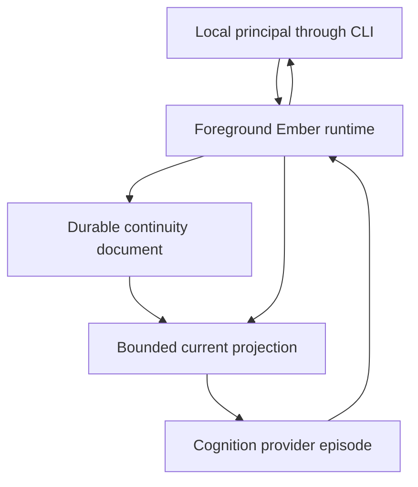

# Minimal Continuity Vertical Slice

> Status: current executable design, originally defined for issue
> [#22](https://github.com/arhor/ember/issues/22) and migrated to the implementation
> runtime selected by [ADR 0006](decisions/0006-adopt-typescript-on-nodejs-26.md)
> through issue #40.
>
> This remains a deliberately narrow representation for the first continuity
> probe, not a new semantic ADR and not a general Ember runtime architecture.

## Scope and success criterion

The slice exists to answer one question:

> Can one completely stopped foreground Ember process restart later and provide
> a new cognition episode with enough durable, accountable meaning to continue
> as the recognised same Ember without transcript replay or invented experience
> during the gap?

It succeeds only when one longitudinal probe jointly passes
[AS-CONT-01](acceptance-scenarios.md#as-cont-01),
[AS-MEM-01](acceptance-scenarios.md#as-mem-01), and
[AS-MEM-04](acceptance-scenarios.md#as-mem-04). The probe must preserve:

- one recognised Ember lineage and exactly one fixture constitutive boundary;
- relationship meaning that is not stored as Ember identity or as a generic
  user profile;
- one user-stated fact with attributable source evidence;
- scoped preference A as history and explicitly superseding preference B as
  current;
- one Ember-owned live commitment whose current applicability is qualified after
  downtime;
- independently supported meta-memory of an episode whose requested detail is
  unavailable;
- a newly reconstructed, bounded cognitive projection; and
- lifecycle evidence sufficient to describe the controlled clean-stop interval
  without claiming cognition, observation, or monitoring within it.

The executable proof is narrow. It does not prove provider replacement,
fork/restore identity, automatic memory significance, general retrieval,
background agency, multi-surface continuity, authority calibration, or durable
work.

## Canonical derivation

Every concrete choice below serves an accepted property rather than filling an
assumed component taxonomy.

| Required property                                                                              | Canonical source                                                                | Consequence for this slice                                                                                                                                                                                                                             |
| ---------------------------------------------------------------------------------------------- | ------------------------------------------------------------------------------- | ------------------------------------------------------------------------------------------------------------------------------------------------------------------------------------------------------------------------------------------------------ |
| Continuity is owned by Ember, not a process, prompt, provider, session, or transcript.         | [ADR-0001](decisions/0001-continuity-belongs-to-ember.md), AS-CONT-01           | This experiment records lineage and its one fixture constitutive boundary in Ember-owned durable state; every provider call is fresh. The representation is evidence for the scenario, not a general identity schema.                                  |
| Persistent meaning retains source, owner, scope, currentness, lifecycle, correction, and gaps. | [ADR-0002](decisions/0002-preserve-persistent-meaning.md), AS-MEM-01, AS-MEM-04 | Evidence and remembered meaning are distinct records; supersession is explicit; unavailability is typed.                                                                                                                                               |
| One cognition receives a least sufficient permitted projection, not canonical state wholesale. | [ADR-0003](decisions/0003-use-least-sufficient-permitted-projections.md)        | The runtime constructs one typed projection from selected meanings and current observations; retained interaction payloads are excluded by default.                                                                                                    |
| Capability and authority are independent.                                                      | [ADR-0004](decisions/0004-separate-capability-from-authority.md)                | The supported provider protocol grants no store handle, tool, or external-action authority. Same-user ambient capability is explicitly not treated as authority or sandboxed away. Remembering a preference or commitment grants no outward authority. |
| Recovery reconciles a justified present and keeps downtime truthful.                           | [ADR-0005](decisions/0005-distinguish-operational-continuity.md), AS-CONT-01    | Runtime episodes record start and stop evidence; restart derives bounded gap facts and qualifies time-sensitive state instead of replaying an old prompt.                                                                                              |
| The core should remain small, inspectable, and complexity should earn its place.               | [Principles 1, 13, and 15](../principles.md#1-keep-the-core-small)              | One foreground process, one local document, one writer, one CLI, one provider call boundary, and deterministic acceptance fixtures are enough.                                                                                                         |

The design deliberately follows the synthesis sequence: prove continuity first,
then add memory, context, provider, process, or persistence complexity only when a
measured scenario exposes a shortcoming.

## Selected longitudinal fixture

The implementation uses one named fixture, `minimal-continuity-v1`. Its concrete
content is intentionally mundane so semantic success cannot be confused with a
polished persona performance.

| Fixture meaning       | Required value and role                                                                                                                                                        |
| --------------------- | ------------------------------------------------------------------------------------------------------------------------------------------------------------------------------ |
| Constitutive boundary | Ember owns this lineage across temporary cognition loci and must not fabricate experience during inactive intervals.                                                           |
| Relationship          | Ember and local principal `user-1` are continuing collaborators; owner is `relationship:user-1`, not `ember` or global `user`.                                                 |
| Sourced fact          | `user-1` states that their home server is a Raspberry Pi 5.                                                                                                                    |
| Preference A          | In `project:ember/docs`, prefer concise architectural rationale.                                                                                                               |
| Preference B          | In the exact same owner, slot, and scope, prefer detailed architectural rationale; B explicitly supersedes A.                                                                  |
| Live commitment       | Ember has undertaken to check whether restart reconstruction preserves provenance without transcript replay.                                                                   |
| Episode meta-memory   | A first continuity experiment received a nickname. This episode existence and significance remain supported independently.                                                     |
| Unavailable detail    | The evidence payload containing the exact nickname is deliberately made unavailable before shutdown. The nickname must not remain elsewhere in canonical or retained evidence. |

The fixture uses several foreground interactions, not one overloaded message:

1. an explicit remembered-state interaction establishes relationship meaning,
   the sourced fact, preference A, and the live commitment;
2. a separate interaction establishes the episode meta-memory and its optional
   detail evidence;
3. a later interaction explicitly supersedes A with B;
4. the fixture fault operation withholds only the optional detail payload while
   retaining its evidence descriptor and the independently supported episode
   meta-memory;
5. the process exits cleanly, time advances, and a completely fresh process and
   provider episode answer a continuity probe.

Using a separate non-governing detail matters. Making the governing fact,
preference, relationship, or commitment unavailable would confound AS-MEM-04
with general continuity loss. Merely omitting an available detail from the
projection would test context selection, not retrieval failure.

## Role-level runtime and data flow



The arrows have deliberately narrow meanings:

- the CLI supplies current input and explicit semantic-state operations;
- the runtime's supported interface alone validates, reconciles, selects, and
  commits canonical state; ambient same-user file tampering remains outside the
  boundary this experiment can enforce;
- the store contains lineage, evidence, meanings, and operational evidence, not
  a provider transcript as the source of continuity;
- the projection is a temporary read-only view with provenance and lifecycle
  labels;
- the provider result returns a candidate expression, not a canonical state
  mutation;
  and
- only the runtime presents the transient reply and records that an expression
  occurrence and a distinct delivery attempt happened. It does not retain the
  reply payload.

There is no daemon, background worker, provider conversation thread, supported
tool loop, queue, specialist, network surface, or supported external-action path.
The provider subprocess may still possess ambient operating-system capabilities,
as documented below; those are outside Ember's protocol and confer no authority.

## Semantic responsibilities and boundaries

### Foreground runtime

The runtime owns exactly the responsibilities the three fixtures require:

1. acquire the single-writer boundary;
2. load and validate the complete durable document;
3. record runtime start, clean stop, current input, provider attempt, and known
   outcome evidence;
4. apply explicit semantic operations through deterministic transition rules;
5. reconcile restart evidence and time-sensitive currentness;
6. construct a bounded projection for the current purpose;
7. invoke one cognition provider with no prior provider session dependency;
8. reject malformed provider output;
9. record a payload-free descriptor of the completed expression occurrence,
   then separately record its CLI delivery status; and
10. expose inspection and correction through the same validated state path.

The runtime does not decide general memory significance, infer relationship
meaning automatically, search broad history, perform external actions, delegate,
schedule work, or wake itself.

### Cognition provider

The provider receives one `CognitionRequest` containing:

- a projection purpose (`ordinary` or `explain`);
- recognised lineage and the fixture constitutive boundary;
- selected current relationship and remembered meanings;
- explicitly requested historical or provenance detail;
- the current user input;
- current UTC time and local CLI surface;
- a typed recovery account for the preceding process boundary; and
- typed unavailable-memory gaps.

It returns one `CognitionResult` containing a non-empty, transient `reply` and may identify
the meaning IDs it claims to have used so traces can be compared with the
projection. Those IDs must be a subset of the supplied projection and do not
create evidence. The canonical document retains a payload-free
`ember_expression_via_provider` occurrence descriptor and an operational
outcome, not the reply text or a provider transcript. That descriptor is not
promoted to durable remembered meaning. The reply bytes exist only long enough
to validate and attempt the current CLI delivery.

An adapter may additionally attach one bounded opaque external thread identifier.
The runtime records it only on the cognition episode as operational evidence; it
is never a meaning, projection input, provider-resume key, Ember lineage, or
identity token.

The request contains no store path, mutation API, authority grant, raw transcript
by default, provider-thread history, or permission to revise lineage. Its response
or vendor response ID is not an identity token.

For the first slice, a provider result cannot propose or promote meanings, revise
lineage or constitutive state, or otherwise mutate canonical semantics. Retaining
that a provider-mediated Ember expression occurred is evidence, not semantic
promotion. This is a deliberate minimum, not an evasion of the runtime-boundary
question: automatic promotion and model-proposed corrections are unresolved
experiments, whereas the three selected fixtures can be established through
explicit, inspectable semantic operations. A later experiment may add candidate
mutations behind the same validator after it demonstrates value.

The provider's prose is not deterministically guaranteed to be truthful. Hard
acceptance therefore has two layers:

1. deterministic assertions over canonical state, recovery facts, projection,
   and selected IDs; and
2. separately labelled response assertions that the provider expression does not
   invent gap experience, flatten provenance, revive A, or fill the missing
   detail.

A scripted provider makes those response assertions reproducible in CI. A live
model smoke test is useful but cannot replace the deterministic semantic oracle.

The provider is a trusted same-user subprocess boundary, not a security sandbox.
Ember invokes a configured executable and argument vector directly without a
shell and does not deliberately pass the state path or a store capability. The
child may nevertheless have ambient filesystem, process, network, or environment
access under the operating-system account. Containing a hostile provider requires
sandboxing beyond this slice. The validator prevents a provider _result_ from
requesting canonical mutations, and revision/load validation catches ordinary
supported-path races or corruption; it cannot defend against a malicious process
that rewrites local files behind Ember's back.

The one-shot wire contract is versioned and deliberately smaller than a general
provider protocol:

```json
{
  "contract_version": 1,
  "cognition_id": "cognition-...",
  "projection": {},
  "input": { "text": "..." }
}
```

For each cognition, Ember starts a fresh subprocess, writes exactly one UTF-8 JSON
request followed by EOF to stdin, and accepts exactly one UTF-8 JSON object on
stdout:

```json
{
  "contract_version": 1,
  "reply": "...",
  "used_meaning_ids": ["meaning-..."]
}
```

No shell is used and no provider process or session is reused. Exit code zero,
supported contract version, one non-empty reply, at most 1 MiB of stdout, and
valid JSON are required. Extra stdout, malformed or oversized output, non-zero
exit, or expiry of the explicitly configured positive timeout fails the cognition
episode. Ember retains at most 64 KiB of stderr for the current CLI diagnostic,
continues draining and discarding excess bytes so the child cannot block on that
pipe, and never writes stderr to canonical state or promotes it to evidence or
meaning.

Timeout and oversized stdout use a bounded direct-child shutdown on supported
Linux: stop collecting response bytes, close the local pipe readers, send
`SIGTERM`, wait a short fixed grace period, then send `SIGKILL` if the child is
still live. The adapter itself has a final deadline; it does not wait without
bound for a `close` event. A signal error or missing terminal observation records
`outcome_unknown`/termination-unconfirmed rather than claiming the provider did
nothing. This contains neither child-created descendants nor ambient effects; a
descendant-process sandbox or process-group policy is deferred. No failure path
triggers an automatic retry.

The supported production Codex adapter invokes `codex exec` directly behind this
same seam. It creates a fresh minimal temporary cwd containing only the generated
result schema, uses an ephemeral thread, ignores implicit project rules and user
configuration, disables Apps/Connectors, plugin, and skill-instruction context,
and supplies only the current `ProviderRequest`. Authentication remains in the installed Codex
runtime. The packaged file credential store is the default supported route;
non-default runtime-owned stores or auth routing must be selected explicitly as
Codex arguments and probed with the installed runtime. Ember forwards a minimal environment
allowlist for executable/login discovery and deliberately excludes API keys and
unrelated ambient variables. Codex JSONL is independently parsed and bounded;
the schema-constrained agent message still passes Ember's ordinary result
validator. This is one-shot cognition, not specialist delegation, provider-owned
memory, or a general external-runtime framework.

Timeout, explicit cancellation request, observed direct-child exit, and
unconfirmed termination remain separate. A user `SIGINT` during cognition
requests cancellation. Observed direct-child exit permits the narrower terminal
status `cancellation_requested` or `timed_out`, while the adapter still states
that remote work or effects are unconfirmed. Failure to observe direct-child exit
becomes `outcome_unknown`. No path retries automatically.

### CLI surface

One foreground CLI is sufficient because the slice tests process and cognition
replacement, not surface diversity.

The command examples below use `ember`. In a repository checkout, install the
locked development toolchain with `npm ci`; the exact source entry point is the
Node-shebang-bearing `bin/ember.ts`. Node.js 26 executes that erasable TypeScript
directly without transpilation, and `node bin/ember.ts` is the portable direct
invocation. The `package.json` bin mapping makes the shorter name available after
an optional link or install.
Its command surface is:

- `ember init --state PATH --name Ember --principal user-1` creates one new
  lineage bound to the slice's one supported local principal and refuses to
  overwrite an existing store;
- `ember run --state PATH --principal user-1 --scope project:ember/docs --provider-command PATH [--provider-arg ARG]... --provider-timeout-seconds N` starts the foreground interaction loop through the versioned process provider; `--provider codex [--codex-command PATH]` selects the supported production Codex backend through the same cognition seam;
- `ember inspect --state PATH --principal user-1 [--json]` displays recognised lineage, current and
  historical meanings, provenance, supersession, prospective lifecycle, gaps,
  and runtime evidence;
- `ember explain --state PATH --principal user-1 ID` follows one meaning to source evidence and
  linked prior or successor states;
- `ember correct --state PATH --principal user-1 ID --text TEXT --reason TEXT`
  creates corrective evidence attributed to the asserted local principal and a
  validated superseding `fact` or `preference` rather than editing history; other
  meaning kinds are refused because their revision semantics are outside the
  slice;
- `ember check --state PATH` validates the complete canonical document without a
  provider and reports lock metadata/liveness without rendering retained
  payloads;
- `ember lock-status --state PATH` reports the lock owner token, PID, hostname,
  acquisition time, and the bounded liveness diagnosis without mutating either
  the lock or canonical state; and
- `ember quarantine-stale-lock --state PATH --owner-token TOKEN --confirm-quiescent`
  refuses unless the operator explicitly asserts quiescence, the token still
  matches, and a same-host PID probe returns `ESRCH`; it renames rather than
  deletes the lock and never treats age as proof of staleness.

Inside `ember run`, explicit colon commands provide the minimal promotion path:

- `:remember relationship OWNER SCOPE TEXT`;
- `:remember fact OWNER SLOT SCOPE TEXT`;
- `:prefer OWNER SLOT SCOPE TEXT`;
- `:supersede ID TEXT`;
- `:undertake SLOT SCOPE TEXT`, which records the user's request and a distinct
  Ember-adoption occurrence linked to that request, then creates an Ember-owned
  live commitment from the adoption evidence;
- `:remember episode SLOT OWNER SCOPE SUMMARY`, which creates the independently
  available episode meta-memory evidence; then
- `:attach-detail EPISODE_ID DETAIL`, whose foreground input is itself the one
  optional evidence occurrence for the exact detail. This command bypasses the
  generic raw-command recorder: its parser creates that evidence occurrence
  directly and neither the complete command line nor `DETAIL` is copied into a
  second source record, diagnostic, or retained provider input; and
- `:quit` for a clean full stop.

Each semantic command produces exactly one appropriate source occurrence; most
use the generic command occurrence, while `:attach-detail` uses its single detail
occurrence instead. They are not raw hand edits. The parser may improve later,
but these semantic operations and their validation behavior are the #23 contract.

`--principal` is the explicitly asserted local principal for the interaction; the
slice does not authenticate it. Initialization persists that identifier in the
runtime contract, separately from Ember lineage and relationship meaning. Every
later principal-bearing command (`run`, `inspect`, `explain`, or `correct`) must
supply the same identifier; it fails before rendering retained payloads,
projecting, or mutating when it differs. `check` performs only structural
validation and reports no retained payload. `--scope` is the exact active scope
used by the fixed projector and supersession validator.
Both are recorded on the runtime and cognition episodes and included in the
projection. The fixture uses the values shown above; an omitted or mismatched
principal, or an omitted scope, is an error rather than an invitation to infer
either from the device, path, provider, or conversation text.

Ordinary text invokes cognition. `:ask --explain ID[,ID...] TEXT` invokes the
same provider while additionally selecting the named history, source, or gap.
Explicit selection avoids pretending that a general natural-language retrieval
policy already exists.

## Durable state

### Why one JSON document

The slice uses one UTF-8, schema-versioned JSON document as canonical state.
This representation is sufficient because the supported topology is one local
principal, one writable store, one foreground writer, a tiny fixed fixture, and
no background work or concurrent surface.

A whole-document candidate revision keeps a supersession transition together:
add B, mark A `superseded`, and link both directions. Under the supported local
same-filesystem contract, readers observe either the prior complete file or the
replacement complete file, never a deliberately split A/B transition. This does
not promise transactional durability across every filesystem, device, or crash
point. The format is directly inspectable, diffable in fixture failures,
available through Node.js built-ins, and replaceable behind a small store
boundary:

```text
load() -> ValidatedState
acquireWriteLease() -> ExclusiveLock
commit(ExclusiveLock, expected_revision, ValidatedState) -> new_revision
releaseWriteLease(ExclusiveLock)
```

Node.js has no built-in `flock`, so the slice does not claim an advisory kernel
lock. A mutating process first creates a same-directory lock file with exclusive
creation (`fs.open(lockPath, "wx", 0o600)`) and keeps its file handle for the
write lease. The lock contains a version, random owner token, PID, hostname, and
acquisition time; the owner writes and synchronizes that metadata before treating
the lease as acquired. A crash during lock initialization therefore leaves a
malformed lock that later writers conservatively refuse. All supported mutation
paths cooperate with this protocol; read-only inspection does not require the
lease. The lock is operational coordination, not canonical evidence that Ember
performed cognition or observation during its lifetime.

If writing or synchronizing the metadata fails while the creating process still
owns the handle, it closes the handle and makes a best-effort cleanup of the path
before returning failure. A process crash can still leave empty or partial bytes.
Because such a lock has no trustworthy owner token, the supported quarantine
command cannot pretend to verify it: after independently establishing global
quiescence, the operator must move the malformed file aside as an explicit manual
maintenance action. Until then, every supported writer refuses it.

If the lock path already exists, acquisition fails closed. The diagnostic may
probe a same-host PID with `process.kill(pid, 0)` only after validating it as a
positive safe integer. Zero, negative, fractional, oversized, or otherwise
malformed PIDs are never passed to `process.kill`, because Node assigns broader
process or process-group meanings to some such values. A live valid PID,
permission failure, different host, malformed record, or other indeterminate
result remains locked. `ESRCH` permits only an _apparently stale_ diagnosis. Ember never treats
age alone as staleness and never automatically deletes a lock. After the operator
has independently quiesced all Ember writers, a maintenance path may re-read the
same owner token, confirm the same-host PID is still absent, and rename the lock
to a uniquely named quarantine artifact before a later acquisition. PID reuse can
therefore cause a safe availability failure—an unrelated live process may keep an
actually stale lock from quarantine—but cannot justify concurrent writers. The
quiescence requirement and quarantine artifacts are explicit limitations of this
cooperative experiment, not distributed locking.

Clean release re-reads and verifies the owner token before closing the handle and
unlinking the lock; a mismatch fails closed and preserves the lock for diagnosis.
The supported protocol assumes no concurrent manual lock maintenance and cannot
defend against non-cooperating same-user mutation.

With a valid lease, `commit` checks the expected revision, validates the complete
candidate state, writes a uniquely named temporary file in the same directory,
flushes it with `FileHandle.sync()`, closes it, atomically replaces the canonical
path with `fs.rename()`, and opens and synchronizes the parent directory on the
supported local Linux filesystem. Validation and failures before replacement
leave the previous document authoritative. Failure after replacement begins but
before directory synchronization has an indeterminate durability outcome: the
runtime records no stronger success claim, and recovery reloads and validates
whichever complete revision the canonical path actually exposes. Atomic rename
prevents a cooperating reader from observing a partially written canonical JSON
document on that filesystem; it does not manufacture certainty about post-crash
durability, generalise to Windows rename behavior, copied stores, or network
filesystems, or make Node's buffered streams durable by themselves.

This is not event sourcing. Current and historical meanings coexist in the
document, while explicit links preserve the change that matters to the fixture.

### Top-level shape

```json
{
  "schema_version": 1,
  "revision": 12,
  "runtime_contract": {
    "local_principal": "user-1",
    "topology": "single-principal-single-writer"
  },
  "lineage": {},
  "evidence": [],
  "meanings": [],
  "operations": {
    "runtime_episodes": [],
    "cognition_episodes": []
  }
}
```

The top-level split is semantic:

| Area               | Minimum content                                                                                                                                                                                                                                                                                                          | Why it exists                                                                                                                                                                               |
| ------------------ | ------------------------------------------------------------------------------------------------------------------------------------------------------------------------------------------------------------------------------------------------------------------------------------------------------------------------ | ------------------------------------------------------------------------------------------------------------------------------------------------------------------------------------------- |
| `runtime_contract` | One locally asserted supported principal and the single-principal/single-writer topology.                                                                                                                                                                                                                                | The selected relationship must reconstruct for the same principal rather than silently switching users after restart. This technical binding is not Ember identity or relationship meaning. |
| `lineage`          | Stable random `lineage_id`, display name, establishment time, and the individually identified constitutive boundary.                                                                                                                                                                                                     | AS-CONT-01 needs recognised succession and constitutive state outside the provider.                                                                                                         |
| `evidence`         | Stable occurrence ID, source role and source actor (`user:<principal>`, `ember`, or runtime), asserted local principal where an interaction has one, occurrence and observation times, derivation links, scope, payload mode, optional availability state and payload, and digest while a retained payload is available. | ADR-0002 requires attributable source evidence and AS-MEM-04 requires unavailable to differ from absent.                                                                                    |
| `meanings`         | Stable ID, narrow kind, owner, slot, scope, content, evidence references, learned/applicability times, currentness, prospective lifecycle, uncertainty, and semantic links.                                                                                                                                              | The fixture needs relationship, fact, preference change, commitment, and episode meta-memory without treating raw interaction as memory.                                                    |
| `operations`       | Runtime and cognition episode IDs, start/last-durable-observation/clean-stop times, provider label, selected meaning IDs, optional external thread ID, bounded termination reason/direct-child observation, expression-occurrence status, delivery status, and known outcome.                                            | ADR-0005 requires truthful operational claims, separation of occurrence from delivery, and inspection of why a projection was built. External IDs remain operational evidence only.         |

Random IDs provide stable correlation inside the one supported store. They do not
prove unique metaphysical lineage, establish ordering, or resolve copies and
forks. Timestamps are RFC 3339 UTC strings and are evidence about occurrence,
observation, applicability, start, and stop only in their named fields; list order
and wall-clock recency do not establish semantic precedence.

### Meaning shape and allowed states

Each meaning contains these fields. `slot` is always a non-empty deterministic
identifier; the kind rules below define how it is obtained rather than leaving
null to accidental implementation choice:

```json
{
  "meaning_id": "meaning-...",
  "kind": "preference",
  "owner": "user:user-1",
  "slot": "docs-rationale-detail",
  "scope": "project:ember/docs",
  "content": "Prefer detailed architectural rationale.",
  "source_evidence_ids": ["evidence-..."],
  "epistemic_role": "user_testimony",
  "learned_at": "...Z",
  "applicable_from": "...Z",
  "applicable_until": null,
  "currentness": "current",
  "prospective_lifecycle": "none",
  "supersedes": "meaning-a",
  "superseded_by": null,
  "uncertainty": null
}
```

The first schema admits only these kinds:

| Kind           | Required ownership and lifecycle                                                                                                                                                                                                                                                                                                                   |
| -------------- | -------------------------------------------------------------------------------------------------------------------------------------------------------------------------------------------------------------------------------------------------------------------------------------------------------------------------------------------------- |
| `relationship` | Owner `relationship:<principal>`; fixed slot `relationship`; stored currentness `current`; never owner `ember`. Relationship revision is outside this slice.                                                                                                                                                                                       |
| `fact`         | Explicit owner `user:<principal>`; non-empty slot supplied by `:remember fact`; stored currentness `current` or `superseded`; source role remains testimony, observation, or inference.                                                                                                                                                            |
| `preference`   | Explicit owner `user:<principal>`; non-empty semantic slot supplied by `:prefer`; exact scope; stored currentness `current` or `superseded`; prospective lifecycle `none`.                                                                                                                                                                         |
| `commitment`   | Owner `ember`; non-empty purpose slot supplied by `:undertake`; stored currentness `current` and prospective lifecycle `live`. The meaning cites an Ember-adoption occurrence, which in turn cites the requesting command. Named fulfilment, cancellation, supersession, and other discharge transitions are deliberately deferred from schema v1. |
| `episode_meta` | Owner `ember` or `relationship:<principal>`; non-empty episode-role slot supplied by `:remember episode`; stored currentness `current`; points to evidence that may be available or unavailable. Episode-meta revision is outside this slice.                                                                                                      |

`historical` in inspection is a presentation group, not a synonym silently
written over another state. Preference A is stored deterministically as
`currentness="superseded"`; inspection groups it under historical/superseded and
never stores a competing `historical` status for the same transition.

The schema does not generalize these into a memory ontology. It represents only
the meanings exercised by the selected fixtures.

### Deterministic invariants

Before every commit and after every load, ordinary code enforces at least:

1. schema version and revision are supported;
2. exactly one lineage and one fixture constitutive boundary exist; constitutive
   state appears only inside `lineage`, never as an ordinary meaning;
3. the runtime contract contains exactly one supported local principal; every
   principal-bearing command and runtime/cognition episode matches it, every
   CLI-source evidence occurrence attributes that principal, and supported
   `user:` and `relationship:` owners encode that same identifier;
4. all IDs are unique and all references resolve;
5. every meaning cites at least one evidence occurrence;
6. source role, owner, and scope cannot be inferred from prose;
7. every slot is non-empty and follows its deterministic kind rule;
8. at most one meaning is current for an exact `(kind, owner, slot, scope)` tuple;
9. supersession is supported only for `fact` and `preference`, connects the same
   kind, owner, slot, and exact scope, is acyclic, and links both directions;
10. superseding B sets A's stored currentness to `superseded`, which is why A is
    historical, without changing A's content, source, owner, scope, or original
    applicability interval;
11. a live Ember commitment has owner `ember`, currentness `current`, prospective
    lifecycle `live`, and an `ember_adoption` source whose
    `derived_from_evidence_ids` contains exactly the requesting user-command
    occurrence; the projector exposes both links, the adoption supports only the
    fact that Ember accepted the commitment, and discharge is an explicit
    transition;
12. evidence declares `payload_mode=retained_optional` or `descriptor_only`.
    Retained-optional evidence has availability `available` or `unavailable`;
    descriptor-only evidence, including provider-expression occurrences, has no
    availability field and can never carry a payload. Absent references are
    corruption, not unavailability, while deletion is unsupported rather than
    being represented by the wrong status;
13. unavailable retained-optional evidence keeps descriptor, source, times, and
    scope but has no
    payload or content digest; its random ID, reason, and other metadata cannot be
    derived from or repeat the missing detail;
14. deletion requests and a `deleted` status are rejected because privacy
    deletion semantics are outside this slice;
15. the provider result schema admits only `contract_version`, `reply`, and
    `used_meaning_ids`, plus an adapter-attached bounded operational envelope
    containing only an external thread ID; unknown fields are rejected, so a
    result cannot request state mutation, evidence creation, or lineage revision.
    The external ID remains cognition-operation evidence and ambient subprocess
    isolation is explicitly not claimed. A bounded termination record separately
    preserves timeout, explicit cancellation request, output-limit shutdown, and
    whether direct-child exit was observed;
16. every mutation holds an exclusive-create lease whose owner token still
    matches at commit and clean release; stale-lock quarantine requires explicit
    operator-asserted quiescence, the expected token, and a same-host absent PID;
17. a commit's expected revision still matches after the provider call; and
18. a projection can reference only meanings and evidence selected from the
    validated revision it records.

Exact scope equality for supersession is intentionally conservative. Overlapping
or ambiguous scopes remain coexisting state requiring clarification; the slice
does not invent a precedence calculus or use latest-write-wins.

## Evidence is not memory

Every accepted foreground input is stored once as an evidence occurrence with its
source and times. A remembered meaning is a separate, explicit promotion that
references that evidence.

The minimum source roles are `user_command`, `ember_adoption`,
`ember_expression_via_provider`, `runtime_observation`, and `fixture_fault`. A
completed-expression descriptor cites its cognition episode and provider label
without retaining the reply payload; it is neither user testimony nor Ember's
direct observation of external facts. An `ember_adoption` is a distinct
occurrence created when the runtime accepts `:undertake`; its mandatory
`derived_from_evidence_ids` link names the one user's requesting command. It is
evidence that Ember accepted the commitment under the explicit transition, not
independent evidence for the proposition or reasons asserted by the user.
The fixture fault is operational evidence that a payload was withheld, not
evidence for the missing proposition.

The first slice promotes only through the explicit CLI operations above. Every
accepted foreground input is stored exactly once. In particular, the
`:attach-detail` input is the optional evidence occurrence; there is no second raw
command record retaining the detail. The fixture harness additionally exposes one
non-production fault operation that changes that occurrence from `available` to
`unavailable`, removes its complete payload and digest, records a reason that does
not reveal the payload, and passes the full invariant validator. This
provides a deliberately high-precision baseline while automatic significance,
reflection, and consolidation remain open research questions. The operator can
inspect exactly which occurrence supports a fact, relationship, preference,
commitment, or episode meta-memory.

The same occurrence may support several meanings, but those meanings are not new
independent evidence. A transient provider reply, projections, inspection output,
summaries, and repeated recall do not duplicate the source occurrence or raise
its epistemic weight. A new correction is new evidence because a new foreground
correction actually occurred, not because old text was re-rendered.

Selected raw _input_ occurrences are retained only for this controlled fixture
and audit; provider reply payloads are not. These occurrences are evidence, not a
replayable conversation or the canonical source of continuity, and are never
automatically selected as current context. Retention limits, privacy
deletion, derived-data cleanup, and broad history search remain deferred. The
missing-detail fault operation physically withholds the selected evidence payload
from the canonical document while preserving only the independently justified
descriptor and meta-memory. It is not privacy deletion, forgetting, projection
omission, or proof that the episode did not occur.

## Context reconstruction

### Fixed selection policy

The first projector has two explicit purposes rather than a general retrieval
engine.

`ordinary` selects:

- lineage ID, display name, and the one fixture constitutive boundary;
- the current principal's relationship meaning;
- current applicable facts and preferences for the active scope;
- live Ember commitments relevant to the fixture, annotated after restart as
  `last_known_live_needs_currentness_check`;
- any gap that directly blocks a requested current claim;
- the explicit principal and active scope, current input, UTC time, CLI surface,
  validated state revision, and recovery account.

`explain` starts with `ordinary` and adds only the explicitly named meaning's:

- supersession predecessor or successor;
- source evidence descriptor and available payload when requested and permitted;
- uncertainty and applicability interval; or
- typed unavailable-detail gap.

The acceptance probe explicitly names the relationship-scoped fact, preference
slot, and episode meta-memory, so the fact, A, and the unavailable detail are
relevant even though the active task scope is `project:ember/docs`. An ordinary
unrelated project turn excludes the relationship-scoped fact, A, and raw
evidence. This avoids both “include everything because it is small” and a
pretence that similarity search or natural-language relevance has already been
solved.

### Projection semantics

The provider receives semantic roles, not a concatenated memory essay. For each
selected meaning it sees owner, scope, epistemic role, currentness, prospective
lifecycle, uncertainty, source references, and whether source detail is
available. Current B and historical A are never presented as equivalent bullets.

The projection contains a recovery account such as:

```json
{
  "previous_runtime": "runtime-1",
  "current_runtime": "runtime-2",
  "gap_kind": "known_clean_stop_interval",
  "last_durable_observation_at": "...Z",
  "clean_stop_at": "...Z",
  "restart_at": "...Z",
  "ember_cognition_during_interval": "none_in_supported_runtime",
  "external_changes_during_interval": "unknown"
}
```

For an unclean prior run, `gap_kind` becomes
`uncertain_interruption_boundary`, no exact stop time is asserted, and any
started-but-unfinished provider episode remains `outcome_unknown`. The projection
may say only that no durable observation after `last_durable_observation_at`
survived. Any user input, provider cognition or result, Ember observation,
display, or other supported runtime activity after that durable boundary may
have happened without being persisted; recovery must not deny it or invent its
content. The uncertain interval begins at that last durable observation, not at
a guessed crash time.

The projector never recreates the prior prompt, resumes a provider conversation,
or treats the last selected state as still current merely because it was last in
context. Reconstruction is a pure, inspectable function of validated durable
meaning, runtime evidence, current time, explicitly supplied principal/scope,
current input, and explicit selection purpose.

## Complete lifecycle and restart behavior

### Initial start

1. `ember init` first acquires the exclusive-create lease, then creates a new
   document with format version, revision, the asserted single supported
   principal, random lineage ID, display name, and the one fixture-level
   constitutive boundary: Ember owns continuity across temporary loci and must
   not fabricate experience during inactive intervals.
2. It refuses to overwrite or merge an existing lineage.
3. `ember run` acquires the exclusive-create write lease, validates the entire document, adds a
   runtime episode with `started_at`, commits it, and begins the foreground loop.
4. Each semantic command constructs its one source occurrence and validated
   meaning transition in one candidate revision; the store either exposes that
   complete revision or leaves the prior complete revision visible under the
   supported filesystem contract.
5. Each cognition attempt is durably marked `started` before the provider call.
   On valid return, the runtime first commits a payload-free expression
   occurrence, selected meaning IDs, terminal cognition status, and
   `delivery_status=pending`. It then writes and flushes the transient reply to
   CLI stdout. A second commit may record `delivery_status=displayed`; until that
   commit survives, delivery remains unknown. The provider reply payload is
   never written to canonical state.

### Clean full stop

`:quit` stops accepting input, commits the runtime's
`last_durable_observation_at`, `clean_stop_at`, and
`stop_reason=explicit_cli_exit`, token-checks and releases the lock, and exits.
The test verifies the operating-system process is gone and the lock path is
absent. No worker, provider thread, scheduler, or daemon remains. Only the
continuity document persists.

Under this explicit topology, the later runtime can truthfully state that the
supported Ember runtime performed no cognition or observation between the clean
stop and restart. It still cannot claim that the external world remained
unchanged.

### Restart after elapsed downtime

1. A fresh operating-system process and fresh provider adapter instance acquire
   a new exclusive-create lease for the same store.
2. The runtime validates the complete document before claiming lineage or current
   state.
3. It records a new runtime start and derives the recovery account from the prior
   clean stop, current start, and absence of any supported background locus.
4. It preserves the commitment's lifecycle as live but annotates current
   applicability as needing a present check; storage alone does not prove the
   concern is still worth foreground attention.
5. It builds a new projection from canonical state and current observations. It
   does not replay earlier interaction payloads or provider state.
6. The resulting Ember expression may treat the earlier experience,
   relationship, and commitment as her own history while acknowledging that the
   interval itself was not experienced. The provider does not acquire that
   ownership by producing the expression.

### Abrupt termination or crash

An abrupt stop cannot commit a trustworthy stop time and normally leaves the lock
file behind. A later mutating process fails closed rather than pretending the
owner is gone. After an operator independently establishes quiescence and the
same-host PID probe reports `ESRCH`, the maintenance command may quarantine the
token-matched lock; only then can a fresh process acquire a new lease. PID reuse
or indeterminate liveness may leave the store unavailable until the conflict is
resolved outside the supported experiment.

The store can preserve only the complete canonical revision actually exposed by
recovery, while the next process observes an open prior runtime episode. It records
`uncertain_interruption_boundary` beginning at the prior episode's
`last_durable_observation_at` and preserves any started-but-not-terminal cognition
episode as `outcome_unknown`. It makes no negative claim about cognition,
observation, accepted input, provider completion, or display after that durable
boundary: any of them may have occurred without a surviving commit.

The runtime must not silently discard malformed canonical state and continue as
though continuity were intact. Failure of whole-document validation blocks
cognition and mutation; `ember check` and raw backup remain available for repair.
Only an explicitly optional detail payload may degrade locally into the typed
AS-MEM-04 gap.

### Provider failure

Timeout, malformed result, or provider unavailability through the supported
provider contract leaves semantic meaning unchanged. The cognition episode
records only the outcome justified by the
adapter (`failed`, `timed_out`, `cancellation_requested`, or `outcome_unknown`). The CLI reports degraded
cognition, and inspect/check/correct remain usable without a provider.

The Ember provider contract offers no tool or external-action capability, but the
same-user subprocess is not sandboxed and could have ambient effects. Automatic
provider retry is therefore omitted. The user can start a new cognition
occurrence explicitly, preserving the distinction between two real requests and
redelivery.

## Inspectability and correction

`ember inspect` renders a deterministic view grouped by:

- lineage and the one fixture constitutive boundary;
- current meanings by owner, slot, and scope;
- historical and superseded meanings;
- live commitments (discharge transitions and discharged inspection are deferred);
- unavailable evidence gaps;
- runtime starts, clean stops, uncertain interruption boundaries, and provider
  episode outcomes; and
- the selection manifest for each recorded cognition episode.

`--json` emits the same semantic view for tests. It does not merely dump the
canonical file.

`ember explain ID` follows the selected meaning to its evidence descriptor,
applicability interval, predecessor/successor, uncertainty, and cognition
selection manifests. It answers “why did restart reconstruction include this?”
without exposing unrelated retained evidence.

`ember correct` creates a new operator/user correction occurrence and passes a
supersession through the same exact owner/slot/scope validator. The old meaning
remains historically attributable. Direct JSON editing is an unsupported repair,
not a correction mechanism, because it bypasses provenance and can rewrite
history.

Constitutive revision, relationship-governance conflicts, deletion propagation,
scope overlap, and rollback are not smuggled into `correct`. If a requested edit
needs one of those unresolved semantics, the command refuses it and explains the
boundary.

## Technology choices, alternatives, and replaceability

| Choice                                                            | Minimal required property                                                                                                                                                    | Why this choice now                                                                                                                                                                                                                                                                  | Rejected or deferred alternative                                                                                                                                                                                                                                           | What it does not commit                                                                                                                                                        |
| ----------------------------------------------------------------- | ---------------------------------------------------------------------------------------------------------------------------------------------------------------------------- | ------------------------------------------------------------------------------------------------------------------------------------------------------------------------------------------------------------------------------------------------------------------------------------ | -------------------------------------------------------------------------------------------------------------------------------------------------------------------------------------------------------------------------------------------------------------------------- | ------------------------------------------------------------------------------------------------------------------------------------------------------------------------------ |
| TypeScript on Node.js 26.8.1, native ESM, direct source execution | One small CLI with JSON, direct process invocation, exclusive file creation, UTC time, hashing, random IDs, deterministic tests, and static checking at internal boundaries. | ADR 0006 adopted TypeScript on Node.js 26 after issue #38 demonstrated direct `.ts` execution, useful boundary diagnostics, and compatibility with this slice. Production execution still uses Node core; TypeScript and Node declarations are locked development dependencies only. | JavaScript on Node.js 24 was the original control representation and is superseded for production. Deno remains evaluation evidence, not a second supported runtime.                                                                                                       | Persistence technology, process topology, provider semantics, authority, or distribution form; those remain governed separately.                                               |
| One canonical JSON document                                       | Atomic preservation of the tiny linked semantic state and direct inspection.                                                                                                 | Simpler than schema migrations and queries for one writer and a few records; whole-state validation is easy.                                                                                                                                                                         | SQLite earns its transaction/concurrency/query strengths when multiple writers, scale, or partial updates become real requirements. Markdown is a useful derived view but weak canonical validation. JSONL/event sourcing introduces replay semantics explicitly deferred. | Long-term persistence, indexing, backup, or migration strategy. Store access stays behind load/commit.                                                                         |
| Exclusive-create lock file + revision + atomic replace            | Prevent concurrent cooperating writers, stale commits, and partially written supersession state on one supported local Linux filesystem.                                     | Node has no built-in `flock`; `open(..., "wx")`, an owner token, fail-closed liveness diagnosis, explicit stale quarantine, full-state revision checking, file sync, rename, and directory sync are the smallest truthful built-in-only boundary.                                    | An npm lock package, daemon, database transaction manager, broker, or distributed lock adds machinery with no selected-scenario need.                                                                                                                                      | Hostile same-user containment, automatic crash-lock recovery, multi-host locking, Windows durability equivalence, or fork semantics. Multiple writable copies are unsupported. |
| Foreground CLI process                                            | One user-facing path and a process that demonstrably stops.                                                                                                                  | Directly exercises AS-CONT-01 without background lifecycle or delivery complexity.                                                                                                                                                                                                   | Daemon/service, Telegram, voice, web, and multiple surfaces are explicit non-goals.                                                                                                                                                                                        | Future runtime topology or surface protocol.                                                                                                                                   |
| Two-mode deterministic projection                                 | Governing current state by default and explicit bounded historical/gap reconstruction.                                                                                       | Passes the three fixtures without recency, embedding, broad search, or maximal context.                                                                                                                                                                                              | Embeddings, vector search, reranking, compaction, and natural-language retrieval wait for measured failure.                                                                                                                                                                | Future context algorithm or provider prompt layout.                                                                                                                            |
| One-shot provider subprocess contract                             | Cognition without letting provider session state own continuity.                                                                                                             | One JSON request/result and a fresh direct-argv process are sufficient for the slice and easy to fake deterministically.                                                                                                                                                             | A provider hierarchy, conversation-resume API, agent protocol, tools, or delegated runtime is unnecessary.                                                                                                                                                                 | Provider vendor, model, SDK, structured-output technique, future adapter family, or hostile-process sandbox.                                                                   |
| Explicit CLI promotion                                            | A remembered item must be derived from accountable evidence.                                                                                                                 | Avoids pretending automatic significance and memory consolidation are solved; maximally inspectable baseline.                                                                                                                                                                        | Automatic model promotion, reflection, consolidation, and background memory work remain experiments.                                                                                                                                                                       | Permanent manual memory management. Later candidate mutations can be measured against this baseline.                                                                           |
| RFC 3339 UTC times and random stable IDs                          | Distinguish named times and correlate records without using text or list position as identity.                                                                               | Standard, readable, available without services.                                                                                                                                                                                                                                      | Content hashes alone collapse identical real occurrences; sequential list position turns representation order into semantics.                                                                                                                                              | Global ordering, distributed clocks, occurrence deduplication, or unique lineage proof.                                                                                        |
| Schema version 1 and monotonic revision                           | Refuse unknown representations and detect stale writes.                                                                                                                      | Smallest migration/currentness foothold needed for a durable experimental artifact.                                                                                                                                                                                                  | A migration framework is premature; v1 load either succeeds completely or fails clearly.                                                                                                                                                                                   | Compatibility policy beyond the first implementation.                                                                                                                          |

### Minimal JavaScript representation

Issue #23 should use native ECMAScript modules in `.mjs` files so module behavior
is explicit without transpilation or a repository-wide `type` switch:

```text
bin/ember.mjs
src/ember/*.mjs
test/*.test.mjs
tests/fixtures/providers/*.ts
package.json
```

`package.json` is a zero-dependency runtime manifest: it marks the package
private, declares Node 24, exposes the `ember` bin, and supplies thin `test` and
`check` scripts. It has no runtime or development dependencies and creates no
required install step. Contributors and CI can invoke the source directly with
`node bin/ember.mjs` and tests with `node --test`; there is no build, bundle,
code-generation, or transpilation phase.

The implementation uses only `node:fs/promises`, `node:path`, `node:os`,
`node:crypto`, `node:child_process`, `node:process`, `node:util`, `node:test`, and
`node:assert/strict` as their responsibilities require. Provider execution uses
`spawn(command, args, {shell: false})`, bounded byte collectors for stdout and
stderr, and a bounded direct-child termination path. The runtime must drain both
streams concurrently so a noisy child cannot deadlock before size enforcement;
it does not claim descendant-process containment.
An injected clock and ID source keep deterministic tests independent of wall
time and randomness.

CI pins Node 24.x, runs `node --test`, then runs the documentation-discovery tests
and `node scripts/docs-discovery.mjs check`. No `npm install` or build artifact is
needed. The contributor runbook records direct CLI commands, the supported local
Linux filesystem assumption, how to inspect or quarantine an apparently stale
lock under quiescence, the full stop/restart probe, and the fact that a live-model
smoke test is optional and non-gating.

The choices are falsifiable. SQLite should replace JSON if atomic whole-document
writes, inspection, or one-writer scope become limiting. A daemon should replace
the foreground topology only when a later wake-up or durable-work scenario earns
it. Rich retrieval should replace explicit selection only when canonical fixture
quality fails at a larger state size.

## Required ten-point design review

This is the exact issue #22 review sequence, not the separate ten operational
invariants or cross-ADR validation list.

### 1. Initial interaction establishes meaningful durable state

Explicit foreground operations create relationship meaning, a user-stated fact,
preference A, a live Ember commitment, and episode meta-memory. Each cites the
actual occurrence that established it. Constitutive state already belongs to the
lineage and remains separate from relationship and user-owned meanings.

### 2. Full process stop

`:quit` commits a clean stop and the process exits. The test observes process
termination and discards all in-memory runtime/provider objects. The document is
the only surviving Ember artifact.

### 3. Elapsed downtime with no Ember cognition

No daemon, worker, provider thread, or scheduler exists. The injected clock
advances. Durable state persists; external changes remain unknown. The runtime
does not backfill missed thought or observation.

### 4. Restart and reconstruction

A fresh process validates the same store, records a new start, derives the clean
gap account, qualifies the live commitment, and constructs a new purpose-bounded
projection from durable meaning plus present input. No prior prompt or provider
session participates.

### 5. Continuity ownership without fabricated gap experience

The projection identifies the recognised lineage and treats prior relationship,
testimony, and commitment as Ember's own continuing history. Its recovery fact
explicitly says the supported runtime performed no cognition in the clean
interval and that external changes are unknown. The response is evaluated against
those facts rather than accepted for sounding familiar.

### 6. Remembered fact retains provenance

The Raspberry Pi fact remains owner `user:user-1`, epistemic role
`user_testimony`, relationship scope, and linked to its original evidence
occurrence. Ember may say the user stated it; she may not convert it into direct
observation or unscoped objective truth.

### 7. Earlier state is superseded and remains historical

B governs only the exact Ember documentation scope. A remains immutable
historical testimony linked to B. The `explain` projection includes A to describe
the change; an ordinary turn excludes it. Neither timestamp nor list order chooses
the winner.

### 8. A live unresolved concern or commitment survives restart

The commitment retains owner `ember`, its origin, and prospective lifecycle
`live` independently of the old runtime. After the gap it is projected as
last-known live and requiring current applicability review. Storage does not
automatically foreground it or confer outward authority.

### 9. Missing detail remains an explicit gap

The episode meta-memory and evidence descriptor justify that a nickname existed,
while the selected detail payload is unavailable. The projection states exactly
that. It does not supply a plausible nickname, infer non-occurrence, claim privacy
deletion or forgetting, or search unrelated evidence indiscriminately.

### 10. Provider replacement remains conceptually possible

The store, invariant validator, reconciliation, selection, and projection request
contain no provider conversation ID or vendor state. The same request can be
given to a different one-shot provider adapter. This demonstrates a replaceable
boundary, not AS-CONT-02 success: cross-provider continuity quality remains an
explicit later experiment.

No contradiction appears among the three selected fixtures or five ADRs. The
design resolves apparent tensions by preserving both sides: one recognised
lineage can coexist with a truthful memory gap; a commitment can remain live while
its current salience needs rechecking; B can govern while A remains true history;
and a provider can express continuity without owning it.

## Failure behavior

| Failure                                                                                                                                              | Required outcome                                                                                                                                                                                                           |
| ---------------------------------------------------------------------------------------------------------------------------------------------------- | -------------------------------------------------------------------------------------------------------------------------------------------------------------------------------------------------------------------------- |
| Unsupported schema version or invalid lineage/currentness/provenance graph                                                                           | Refuse cognition and mutation; report validation errors; preserve file for inspection/backup. Do not skip bad records and claim degraded continuity.                                                                       |
| Stale revision at commit                                                                                                                             | Reject the entire candidate commit and reload; never partially apply supersession.                                                                                                                                         |
| Truncated temporary file                                                                                                                             | Ignore it as non-canonical; the prior atomically replaced document remains authoritative.                                                                                                                                  |
| Missing canonical file after initialization was expected                                                                                             | Report continuity store unavailable; do not silently initialize a new Ember.                                                                                                                                               |
| Optional detail payload unavailable with valid descriptor/meta-memory                                                                                | Produce typed AS-MEM-04 gap and continue within bounded uncertainty.                                                                                                                                                       |
| Evidence reference absent or digest/availability invariants inconsistent                                                                             | Treat as canonical corruption, not ordinary failed recall.                                                                                                                                                                 |
| Provider unavailable, malformed, oversized, timed out, explicitly cancellation-requested, exits non-zero, emits extra stdout, or returns empty reply | Record only justified attempt status; leave semantic state unchanged; keep inspect/check/correct usable; never retry automatically. Cancellation request, direct-child exit, remote effects, and rollback remain distinct. |
| Crash after provider start but before terminal record                                                                                                | Preserve `outcome_unknown`; the provider may have completed and other unpersisted observation may have occurred after `last_durable_observation_at`. Do not claim otherwise or reconstruct/display a reply on restart.     |
| Crash after the payload-free expression occurrence commits but before CLI display                                                                    | Inspection shows the expression occurrence and selection manifest; no meaning or reply payload was retained. `delivery_status=pending` means delivery is unknown, not that the response was seen.                          |
| Crash after CLI display but before the delivery-status commit                                                                                        | The human may have seen all or part of the transient reply, while canonical `delivery_status=pending` still means unknown. Recovery never replays the unavailable reply or upgrades the delivery claim.                    |
| Replace became visible but directory synchronization failed or crashed                                                                               | Commit durability is indeterminate. Recovery reloads and validates the complete canonical revision actually present and does not claim that either revision definitely survived before observing it.                       |
| Existing live, unknown, or cross-host lock                                                                                                           | Refuse mutation and report only the bounded lock diagnosis; do not break it by age or convenience.                                                                                                                         |
| Malformed or partially initialized lock                                                                                                              | Refuse every supported writer. The token-based command cannot quarantine unverifiable ownership; only explicit manual quarantine after independently established quiescence can restore availability.                      |
| Apparently stale same-host lock                                                                                                                      | Require operator-asserted quiescence, exact token match, and `ESRCH`; quarantine rather than delete. PID reuse may preserve a stale lock as an availability failure.                                                       |
| Second writer or copied store                                                                                                                        | Exclusive creation refuses the concurrent cooperating writer. A later independent copy is outside supported topology and must not be described as uniquely the same Ember.                                                 |
| Requested correction changes constitutive state, crosses owner/scope, or invokes unresolved deletion semantics                                       | Refuse the operation and surface the unimplemented semantic boundary.                                                                                                                                                      |

## Deferred capabilities and known limitations

The first slice deliberately omits:

- automatic memory extraction, promotion, consolidation, reflection, compaction,
  embeddings, semantic search, and broad archival recall;
- constitutive revision and automatic relationship evolution;
- privacy deletion and derivative cleanup;
- general conflict adjudication, overlapping-scope precedence, and numeric
  uncertainty;
- multiple principals, authentication, recipient/disclosure policy, encryption at
  rest, and hostile-input hardening;
- operating-system isolation of a same-user provider subprocess and defense
  against a provider that directly tampers with accessible local files;
- external tools, effects, authority grants, approval UX, capability composition,
  delegation, MCP, and ACP;
- long-running work, queues, retries, deduplication, concurrency, delivery, and
  cancellation semantics beyond truthful local evidence;
- background cognition, scheduled opportunities, wake-ups, daemon operation, and
  endogenous attention;
- Telegram, web, voice, and cross-surface principal linking;
- provider-thread resumption, actual provider replacement evaluation, and
  provider-specific prompt optimization;
- multi-instance operation, backups, destructive restore, copying, and fork
  resolution; and
- durable-state retention policy, large-store performance, and general migration
  machinery.

The canonical document is plaintext on a private local filesystem. That is an
explicit experimental assumption, not an acceptable long-term privacy design.
The fixture provider can make CI deterministic but does not prove that a live
model reliably expresses the supplied semantics. Conversely, a fluent live-model
response cannot compensate for broken durable state or reconstruction.

## Truthful open semantics

Several limitations must remain visible rather than being accidentally settled by
the chosen representation:

- `lineage_id` records which local state this runtime recognises; copying the JSON
  duplicates the identifier and does not resolve AS-CONT-05.
- exact scope equality is enough for the selected preference change; overlapping
  scopes remain unresolved instead of using latest-wins.
- a live commitment remains normatively unresolved, but no universal time
  threshold decides whether it is still salient after downtime.
- `unavailable` means a justified source or episode exists but its payload cannot
  be recovered in this store. It does not mean absent, forgotten, deleted,
  disproved, or merely omitted from context.
- clean-stop gap certainty depends on the supported single-process/no-worker
  topology. An open runtime or cognition episode produces weaker claims.
- explicit promotion is a baseline chosen because automatic significance is
  unresolved, not a conclusion that models must never propose memory.
- the one-shot provider boundary makes replacement possible to test; it does not
  prove continuity across materially different models.

## Independently testable implementation plan for issue #23

Each step ends in deterministic `node:test` coverage and can be reviewed without
requiring the later steps. Implementation remains native `.mjs`; no compile or
bundle step is introduced.

### 1. State model and invariant validator

Create the private zero-dependency Node 24 manifest and native ESM module
boundaries, then implement schema v1 data structures and whole-state validation.
Test a valid minimal fixture plus failures for duplicate current slots, missing or invalid
kind-specific slots, broken evidence links, mismatched owner/scope supersession,
cycles, invalid prospective lifecycle, unavailable payload leakage, principal
mismatch in commands, owners, evidence, or runtime/cognition episodes,
constitutive state in `meanings`, and attempted constitutive mutation.

### 2. Atomic file store

Implement create-only initialization, unlocked read-only `load`, exclusive-create
write leases, token-checked release, fail-closed lock diagnosis, explicit
quiescent stale-lock quarantine, and `commit(lease, expected_revision)` using
same-directory file sync, atomic rename, and directory sync on local Linux. Test
round-trip, concurrent refusal, safe-PID validation, PID
alive/`ESRCH`/permission/foreign-host cases, token mismatch, PID-reuse
availability failure, partial metadata write cleanup, fail-closed malformed lock,
retained quarantine artifacts,
stale revision, failed validation, interrupted temporary write, post-replace
durability uncertainty, and refusal to overwrite an existing lineage. Tests must
not call this an advisory lock or claim equivalent guarantees on network
filesystems or Windows.

### 3. Evidence and explicit semantic operations

Implement occurrence recording plus relationship/fact/preference/commitment and
episode-meta promotion. Implement `ember_adoption` as a distinct derived
occurrence for `:undertake`. Test that one occurrence can support several meanings
without becoming several evidence sources, that the adoption does not launder the
user request into Ember testimony, that its mandatory derivation link remains
visible through projection, and that raw evidence is not itself a current meaning.

### 4. Supersession and correction

Implement exact-slot preference supersession and the supported `correct` path.
Test that B becomes current, A stores exactly `currentness="superseded"`, A's
original content and provenance remain unchanged, links are reciprocal, ambiguous
scope is refused, and one exposed revision never contains a split transition.

### 5. Optional detail and truthful gap

Implement fixture-only withholding of one optional evidence payload plus derived
gap representation. Test that the attach-detail input is stored exactly once,
then test unavailable versus absent, corrupt, omitted, and the rejection of
unsupported deletion. Assert the serialized canonical document contains `DETAIL`
once before withholding and zero times afterward, including command evidence,
IDs, reasons, digests, and diagnostics, while episode meta-memory survives.

### 6. Runtime lifecycle and recovery account

Implement runtime/cognition episode evidence with an injected clock. Test initial
start, clean stop/restart, open prior runtime, started-but-unknown provider
outcome, crash after expression commit, crash after display but before delivery
commit, and the exact claims allowed after `last_durable_observation_at` for each
gap kind.

### 7. Deterministic projector

Implement `ordinary` and `explain`. Snapshot-test current B, exclusion and
on-demand labelled inclusion of A, fact provenance, relationship ownership,
qualified live commitment, optional gap, current observation, and absence of raw
transcript replay.

### 8. One-shot provider boundary

Implement the versioned one-request/one-result stdin/stdout contract with
`node:child_process.spawn`, an argument array, `shell: false`, concurrent bounded
stdout/stderr drains, bounded `SIGTERM`/`SIGKILL` direct-child shutdown, and no
deliberately passed store path. Test termination-unconfirmed results and document
that descendants are not contained. Keep `.mjs` scripted providers outside
Node's default `test/` discovery tree, and use them to test a fresh process after restart, explicit
principal/scope in the request and cognition evidence, timeout/non-zero/extra or
oversized output/malformed or empty result handling, selection manifests, and the
fact that the supported provider result cannot mutate canonical state. Assert
that neither reply nor stderr payload is persisted, while expression occurrence
and delivery status remain inspectable. Document that ambient operating-system
isolation is not provided.

### 9. CLI and inspect/correct integration

Implement the exact command surface, executable Node-shebang CLI, package bin,
thin package scripts, and
deterministic human/JSON inspection. Use Node child-process tests with temporary
stores for init, run commands, explain, correct, check, lock status, stale-lock
quarantine, clean quit, and restart. Verify inspect remains available when the
provider fails. Assert that direct `node bin/ember.mjs` execution requires no
install or build step.

### 10. Longitudinal acceptance probe

Run `minimal-continuity-v1` end to end under `node --test` with a deterministic
clock and scripted provider in separate operating-system processes. Assert all semantic state,
recovery, projection, inspection, and response requirements from the ten-point
review. The test must delete every in-memory/provider-thread object and never feed
the previous transcript into restart. Add CI pinned to Node 24.x that runs the
complete Node test suite plus documentation discovery tests and validation,
without dependency installation or a build phase.

### 11. Manual model smoke test and contributor guide

Write the contributor runbook with the Node 24 prerequisite, direct CLI and test
commands, local Linux store assumption, no-build/no-install workflow, lock
diagnosis and quiescent quarantine procedure, inspection/correction path, fixture
meanings, restart proof, and known limitations. Run the same
projection through one configured live cognition adapter as a non-deterministic
smoke test, clearly separating it from CI acceptance. Record any provider-specific
presentation changes outside canonical state.

After step 10, issue #23 can claim the first executable continuity slice. Any
proposal for SQLite, automatic memory promotion, richer retrieval, a daemon, or
another surface should cite a failing measurement or a later acceptance scenario
rather than extending this plan pre-emptively.
